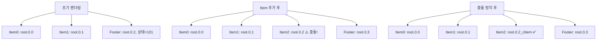
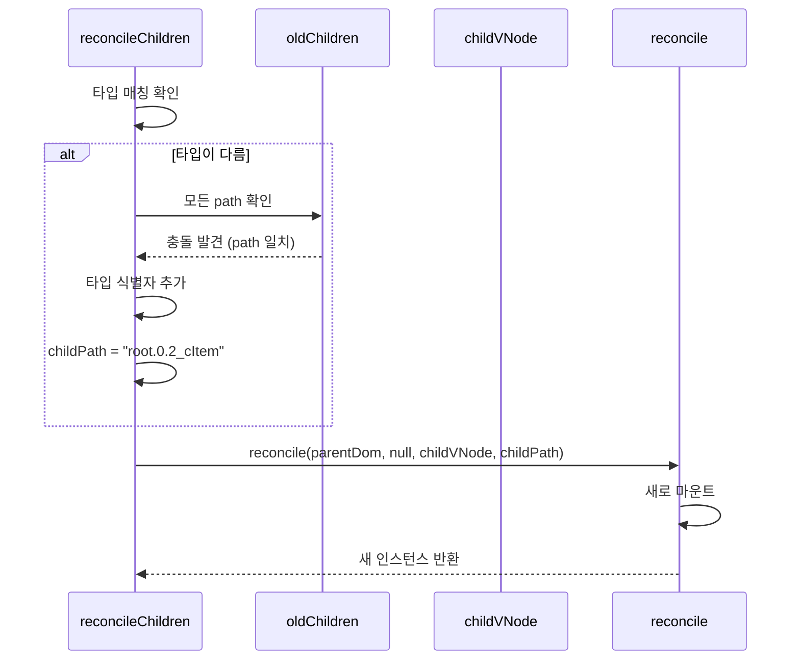

# Reconciliation 문제 분석 학습 가이드

## 📖 학습 목표

- 중첩된 컴포넌트에서 useState가 각각 독립적으로 동작하도록 Path 충돌 문제를 이해하고 해결할 수 있다
- 타입이 다른 컴포넌트가 같은 path를 사용할 때 발생하는 훅 상태 충돌 문제를 파악하고 해결할 수 있다
- `reconcileChildren`과 `reconcile` 함수에서 Path 충돌을 방지하는 메커니즘을 구현할 수 있다

## 📚 핵심 개념

### 1. Path 기반 상태 격리 시스템

Mini-React에서는 각 컴포넌트의 훅 상태를 `path`를 기반으로 격리합니다. Path는 컴포넌트 트리에서의 위치를 나타내는 고유 식별자입니다.

**Path 생성 규칙**:
```typescript
function createChildPath(parentPath: string, key: string | null, index: number): string {
  const id = key ?? index.toString();
  return parentPath ? `${parentPath}.${id}` : id;
}
```

**예시**:
- 루트: `"root"`
- 루트의 첫 번째 자식: `"root.0"`
- 루트의 두 번째 자식: `"root.1"`
- key가 있는 경우: `"root.user-123"` (key = "user-123")

**상태 저장 구조**:
```typescript
context.hooks.state = new Map<string, Hook[]>();
// 예: { "root.0.1": [hook1, hook2], "root.0.2": [hook3] }
```

### 2. Path 충돌 문제

#### 문제 상황

컴포넌트가 동적으로 추가/제거되거나 재배치될 때, 타입이 다른 컴포넌트가 같은 path를 사용하면 훅 상태가 섞일 수 있습니다.

**예시 시나리오**:
```typescript
// 초기 렌더링
<div>
  <Item />  // path: "root.0.0"
  <Item />  // path: "root.0.1"
  <Item />  // path: "root.0.2"
  <Footer /> // path: "root.0.3", 상태: footerCount = 101
</div>

// Item이 2개로 줄어든 후 다시 4개로 증가
<div>
  <Item />  // path: "root.0.0"
  <Item />  // path: "root.0.1"
  <Item />  // path: "root.0.2" (새로 생성됨)
  <Item />  // path: "root.0.3" (⚠️ Footer의 기존 path!)
</div>
```

**문제 발생**:
- Footer는 인덱스가 변경되어 `root.0.2` 또는 `root.0.4`로 이동해야 함
- 하지만 Footer의 훅 상태는 여전히 `root.0.3`에 남아있음
- 새로 생성된 Item3이 `root.0.3` path를 사용하면 Footer의 상태를 가져옴 ❌

### 3. 타입 기반 인스턴스 매칭

`reconcileChildren` 함수에서는 key와 타입을 기반으로 기존 인스턴스를 매칭합니다.

**매칭 규칙**:
1. **Key가 있는 경우**: key로 매칭
2. **Key가 없는 경우**: 인덱스와 타입으로 매칭
3. **타입 불일치**: 타입이 다르면 절대 매칭하지 않음

```typescript
const isTypeMatch = matchedInstance !== null && matchedInstance.node.type === childVNode.type;
```

## 🔍 중요 포인트

### 1. reconcileChildren에서 타입이 다를 때 Path 충돌 방지

타입이 다른 컴포넌트가 같은 path를 사용하지 않도록, path 충돌을 검사하고 고유한 path를 생성해야 합니다.

**핵심 로직**:
```typescript
// 타입이 다를 때 새 path가 모든 기존 인스턴스의 path와 같지 않도록 보장
if (!isTypeMatch) {
  // 모든 oldChildren의 path를 확인하여 충돌 방지
  for (const oldChild of oldChildren) {
    if (oldChild && oldChild.path === childPath) {
      // 타입이 다르고 path가 같다면, 타입 정보를 포함하여 고유한 path 생성
      const typeIdentifier =
        typeof childVNode.type === "function"
          ? `c${childVNode.type.name || "Component"}`
          : typeof childVNode.type === "string"
            ? `h${childVNode.type}`
            : "unknown";
      childPath = `${childPath}_${typeIdentifier}`;
      break;
    }
  }
}
```

**동작 원리**:
1. 타입이 다른 경우 (`!isTypeMatch`), 새로 생성된 `childPath`가 기존 인스턴스의 path와 충돌하는지 확인
2. 충돌이 발생하면 타입 식별자를 추가하여 고유한 path 생성
   - 함수형 컴포넌트: `cComponentName` (예: `cItem`)
   - HTML 요소: `hTagName` (예: `hdiv`)
3. 결과: `root.0.3_cItem` (Item 컴포넌트), `root.0.3` (Footer 유지)

### 2. reconcile에서 타입이 다를 때 기존 Path의 훅 상태 정리

컴포넌트 타입이 변경되면 기존 path의 훅 상태를 명시적으로 정리해야 합니다.

**핵심 로직**:
```typescript
// 타입이 다를 때는 기존 path의 훅 상태를 정리해야 합니다
const isTypeChange = instance !== null && nextNode.type !== instance.node.type;
if (isTypeChange && context.hooks.state.has(path)) {
  // 기존 path의 훅 상태를 정리합니다
  const oldHooks = context.hooks.state.get(path);
  if (oldHooks) {
    // 이펙트 클린업 함수 실행
    oldHooks.forEach((hook) => {
      if (hook.kind === HookTypes.EFFECT) {
        const effectHook = hook as EffectHook;
        if (effectHook.cleanup && typeof effectHook.cleanup === "function") {
          effectHook.cleanup();
        }
      }
    });
  }
  context.hooks.state.delete(path);
  context.hooks.cursor.delete(path);
}
```

**동작 원리**:
1. 타입이 변경된 경우 (`isTypeChange`), 기존 path의 훅 상태가 있는지 확인
2. 이펙트 클린업 함수가 있으면 실행 (메모리 누수 방지)
3. `context.hooks.state`와 `context.hooks.cursor`에서 해당 path 삭제
4. 새로운 타입의 컴포넌트가 같은 path를 사용해도 충돌하지 않음

### 3. 타입이 다른 인스턴스는 null로 전달하여 새로 마운트

타입이 다른 인스턴스는 재사용하지 않고, `null`로 전달하여 새로 마운트해야 합니다.

**핵심 로직**:
```typescript
// 타입이 다른 인스턴스는 null로 전달하여 새로 마운트되도록 합니다
// 이는 타입이 다른 컴포넌트가 같은 path를 공유하는 것을 방지합니다
const instanceToReconcile = isTypeMatch && matchedInstance ? matchedInstance : null;

const reconciledInstance = reconcile(parentDom, instanceToReconcile, childVNode, childPath);
```

**동작 원리**:
1. 타입이 일치하고 매칭된 인스턴스가 있으면 재사용
2. 타입이 다르거나 매칭된 인스턴스가 없으면 `null` 전달
3. `reconcile` 함수에서 `null`을 받으면 새로 마운트
4. 새로 마운트되면 새로운 path가 할당되거나 기존 path 충돌이 해결됨

## 💡 실전 예제

### 문제 상황

```typescript
function App() {
  const [itemCount, setItemCount] = useState(2);
  
  return (
    <div>
      {Array.from({ length: itemCount }).map((_, i) => (
        <Item key={i} />
      ))}
      <Footer />  // path: "root.0.2" (itemCount=2일 때)
    </div>
  );
}

// itemCount가 4로 변경되면
<div>
  <Item key={0} />  // path: "root.0.0"
  <Item key={1} />  // path: "root.0.1"
  <Item key={2} />  // path: "root.0.2" ⚠️ Footer의 기존 path와 충돌!
  <Item key={3} />  // path: "root.0.3"
  <Footer />        // path: "root.0.4" (새로운 위치)
</div>
```

### 해결 방법

**1단계: reconcileChildren에서 Path 충돌 방지**

```typescript
// Item2가 Footer의 기존 path(root.0.2)와 충돌하는지 확인
if (!isTypeMatch) {  // Item !== Footer
  for (const oldChild of oldChildren) {
    if (oldChild && oldChild.path === childPath) {  // "root.0.2"
      // 타입이 다르므로 타입 식별자 추가
      const typeIdentifier = "cItem";  // Item 컴포넌트
      childPath = `${childPath}_${typeIdentifier}`;  // "root.0.2_cItem"
      break;
    }
  }
}
```

**결과**:
- Item2: `root.0.2_cItem` (충돌 방지)
- Footer: `root.0.4` (새로운 위치)

**2단계: Footer가 이동할 때 기존 Path 정리 (필요시)**

Footer는 같은 타입이므로 path가 변경되면 자동으로 정리됩니다. 타입이 변경된 경우에만 명시적으로 정리합니다.

## 🎨 시각적 자료

### Path 충돌 발생 시나리오



### 해결 흐름



## 📌 요약

### 핵심 원칙

1. **Path 충돌 방지**: 타입이 다른 컴포넌트가 같은 path를 사용하지 않도록 타입 식별자를 추가하여 고유한 path 생성
2. **타입 기반 매칭**: 타입이 다르면 절대 인스턴스를 재사용하지 않고 새로 마운트
3. **명시적 상태 정리**: 타입이 변경되면 기존 path의 훅 상태를 명시적으로 정리하여 메모리 누수 방지

### 구현 포인트

- `reconcileChildren`: 타입이 다를 때 path 충돌 검사 및 고유 path 생성
- `reconcile`: 타입 변경 시 기존 path의 훅 상태 정리
- 타입 식별자: `cComponentName` (함수형), `hTagName` (HTML 요소)

### 학습 효과

이 학습을 마친 후, 중첩된 컴포넌트 구조에서 useState가 각각 독립적으로 동작하도록 Path 충돌을 방지하는 메커니즘을 구현할 수 있습니다.

