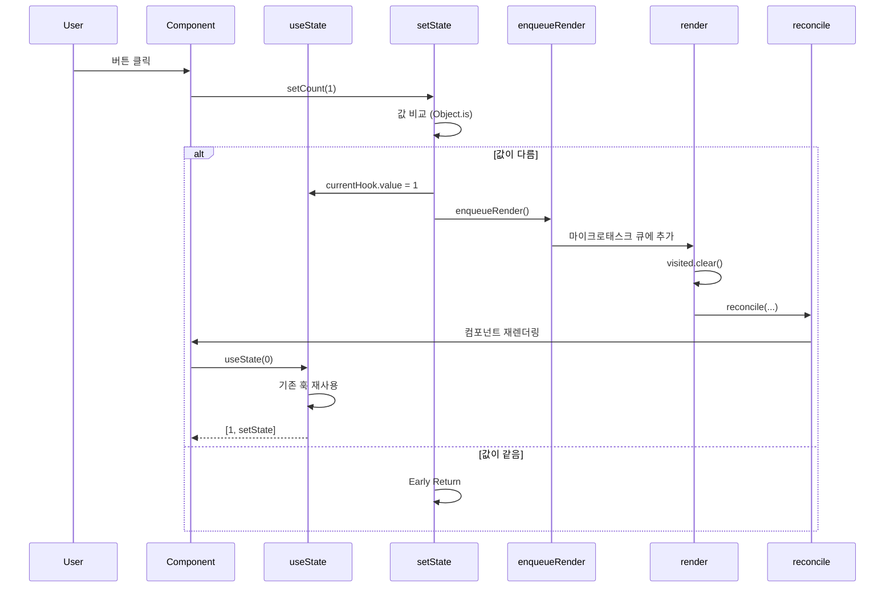
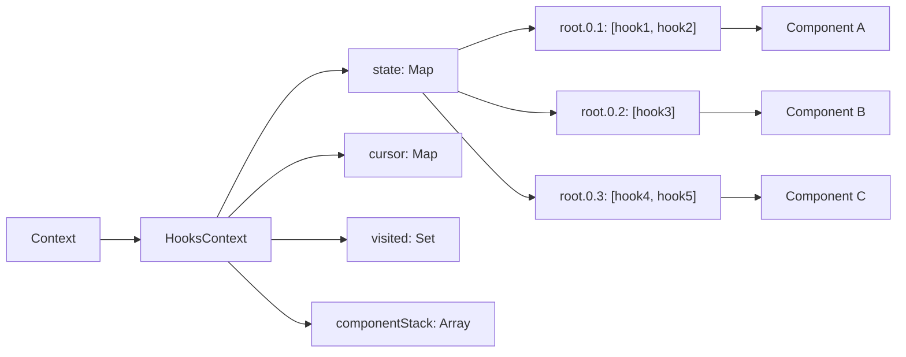

# useState 구현 학습 가이드

## 📖 학습 목표

- useState 훅의 내부 구조와 동작 방식을 이해하고 구현할 수 있다
- Path 기반 상태 격리 시스템을 이해하고 각 컴포넌트의 상태가 독립적으로 관리되는 원리를 파악할 수 있다
- useState의 라이프사이클(마운트, 업데이트, 언마운트)과 Reconciliation 연동 방식을 이해하고 구현할 수 있다
- setState 함수의 동작 원리(Object.is 비교, 함수형 업데이트, 재렌더링 스케줄링)를 이해하고 구현할 수 있다

## 📚 핵심 개념

### 1. Path 기반 상태 격리 시스템

Mini-React에서는 각 컴포넌트의 훅 상태를 `path`를 기반으로 격리합니다. Path는 컴포넌트 트리에서의 위치를 나타내는 고유 식별자로, 각 컴포넌트가 독립적인 상태를 가질 수 있도록 보장합니다.

#### Path 구조

```typescript
interface HooksContext {
  // path를 키로 사용하여 각 컴포넌트의 훅 상태를 격리
  state: Map<string, State[]>;        // path별 훅 상태 배열
  cursor: Map<string, number>;        // path별 훅 커서 (다음 훅 인덱스)
  visited: Set<string>;               // 현재 렌더링에서 방문한 path
  componentStack: string[];           // 컴포넌트 스택 (현재 실행 중인 컴포넌트 추적)
  
  // Getter 프로퍼티
  currentPath: string;                 // 현재 컴포넌트의 path
  currentCursor: number;               // 현재 컴포넌트의 훅 커서
  currentHooks: State[];               // 현재 컴포넌트의 훅 배열
}
```

#### Path 생성 규칙

```typescript
function createChildPath(parentPath: string, key: string | null, index: number): string {
  const id = key ?? index.toString();
  return parentPath ? `${parentPath}.${id}` : id;
}
```

**Path 예시**:
- 루트: `"root"`
- 루트의 첫 번째 자식: `"root.0"`
- 루트의 첫 번째 자식의 두 번째 자식: `"root.0.1"`
- key가 있는 경우: `"root.0.user-123"` (key = "user-123")

#### 상태 저장 구조

```typescript
context.hooks.state = {
  "root.0.1": [
    { kind: "state", type: "state", value: 0 },      // 첫 번째 useState
    { kind: "state", type: "state", value: "" }      // 두 번째 useState
  ],
  "root.0.2": [
    { kind: "state", type: "state", value: 100 }     // 다른 컴포넌트의 useState
  ]
}
```

### 2. useState의 라이프사이클

useState는 컴포넌트의 라이프사이클과 밀접하게 연관되어 있으며, 각 단계에서 다른 동작을 수행합니다.

#### 2.1 마운트 (Mount) 단계

**컴포넌트 렌더링 시작**:
```typescript
function renderFunctionComponent(component, props, path) {
  context.hooks.componentStack.push(path);  // 스택에 path 추가
  context.hooks.visited.add(path);          // visited에 추가
  context.hooks.cursor.set(path, 0);       // 커서를 0으로 초기화
  
  if (!context.hooks.state.has(path)) {
    context.hooks.state.set(path, []);      // 훅 배열 초기화
  }
  
  try {
    return component(props);  // 컴포넌트 함수 실행
  } finally {
    context.hooks.componentStack.pop();  // 스택에서 제거
  }
}
```

**동작 순서**:
1. `componentStack`에 path push → `currentPath`가 이 path를 반환
2. `visited`에 path 추가 → cleanup에서 제거되지 않도록 보호
3. `cursor`를 0으로 초기화 → 첫 번째 훅부터 시작
4. 훅 배열이 없으면 초기화
5. 컴포넌트 함수 실행 (useState 호출)
6. `componentStack`에서 path pop

**useState 호출**:
```typescript
// 첫 번째 useState 호출
const [count, setCount] = useState(0);
// path: "root.0.1"
// cursor: 0
// hooksForPath[0] = { kind: "state", type: "state", value: 0 }

// 두 번째 useState 호출
const [name, setName] = useState("");
// path: "root.0.1" (같은 컴포넌트)
// cursor: 1
// hooksForPath[1] = { kind: "state", type: "state", value: "" }
```

#### 2.2 업데이트 (Update) 단계

**상태 변경 트리거**:
```typescript
setCount(1);  // setState 호출
// 1. currentHook.value = 1로 업데이트
// 2. enqueueRender() 호출
```

**재렌더링 시작**:
```typescript
export const render = (): void => {
  context.hooks.visited.clear();  // visited만 초기화 (상태는 유지)
  const newInstance = reconcile(root.container, root.instance, root.node, "root");
  root.instance = newInstance;
  cleanupUnusedHooks();  // 사용되지 않은 훅 정리
};
```

**중요**: `visited`만 초기화하고 `state`와 `cursor`는 유지합니다. 이는 컴포넌트가 재렌더링되어도 상태를 보존하기 위함입니다.

**컴포넌트 재렌더링**:
```typescript
// renderFunctionComponent 함수
context.hooks.cursor.set(path, 0);  // 커서를 0으로 리셋
// 하지만 state는 유지됨

// useState에서
let hook = hooksForPath[cursor];  // cursor = 0
// hook이 이미 존재하므로 초기값 무시하고 기존 값 사용
// hook.value = 1 (이전에 setCount(1)로 업데이트된 값)
```

**동작 순서**:
1. `cursor`를 0으로 리셋 (훅 호출 순서 보장)
2. `visited`에 path 추가 (cleanup 방지)
3. 컴포넌트 함수 실행
4. `useState` 호출 시 기존 훅 재사용

#### 2.3 언마운트 (Unmount) 단계

**컴포넌트 제거**:
```typescript
// reconcile 함수에서
if (!node) {
  if (instance) removeInstance(parentDom, instance);
  return null;
}
```

**훅 상태 정리**:
```typescript
export const cleanupUnusedHooks = () => {
  for (const [path, hooks] of context.hooks.state.entries()) {
    if (!context.hooks.visited.has(path)) {
      // 이펙트 클린업 함수 실행
      hooks.forEach((hook) => {
        if (hook.kind === HookTypes.EFFECT) {
          const effectHook = hook as EffectHook;
          if (effectHook.cleanup && typeof effectHook.cleanup === "function") {
            effectHook.cleanup();
          }
        }
      });
      
      // 훅 상태 삭제
      context.hooks.state.delete(path);
      context.hooks.cursor.delete(path);
    }
  }
};
```

**동작 원리**:
- `visited`에 없는 path는 사용되지 않는 컴포넌트
- 해당 path의 모든 훅 상태를 삭제
- 이펙트 클린업 함수 실행 (useEffect의 경우)

### 3. setState 함수의 동작 원리

`setState` 함수는 상태 변경을 요청하고 재렌더링을 스케줄링하는 역할을 합니다.

#### 3.1 setState 구현

```typescript
const hookIndex = cursor;
const setState = (nextValue: T | ((prev: T) => T)) => {
  const currentHook = hooksForPath[hookIndex] as { value: T };
  const previous = currentHook.value;
  
  // 함수형 업데이트 또는 직접 값
  const next = typeof nextValue === "function" 
    ? (nextValue as (prev: T) => T)(previous) 
    : nextValue;
  
  // 값이 같으면 재렌더링 건너뛰기
  if (Object.is(previous, next)) return;
  
  // 상태 업데이트 및 재렌더링 요청
  currentHook.value = next;
  enqueueRender();
};
```

#### 3.2 Object.is 비교

`Object.is()`는 값 비교를 수행하며, `===`와 유사하지만 다음 차이점이 있습니다:
- `Object.is(NaN, NaN)` → `true` (===는 `false`)
- `Object.is(+0, -0)` → `false` (===는 `true`)

값이 같으면 재렌더링을 건너뛰어 성능을 최적화합니다.

#### 3.3 함수형 업데이트

```typescript
// 함수형 업데이트
setCount(prev => prev + 1);

// 직접 값
setCount(5);
```

함수형 업데이트는 이전 값을 기반으로 새 값을 계산하며, 비동기 업데이트에서도 올바르게 동작합니다.

#### 3.4 재렌더링 스케줄링

```typescript
export const enqueueRender = withEnqueue(render);
```

`withEnqueue`는 마이크로태스크 큐를 사용하여 중복 실행을 방지합니다:
- 여러 `setState` 호출이 있어도 `render`는 한 번만 실행됨
- `Promise.resolve().then(render)` 방식으로 비동기 실행
- 동일한 렌더링 사이클에서 여러 상태 업데이트를 배치 처리

### 4. Reconciliation과 useState 연동

컴포넌트가 업데이트될 때는 기존 path를 유지하여 상태를 보존합니다.

#### 4.1 함수형 컴포넌트 업데이트

```typescript
if (typeof nextNode.type === "function") {
  // 기존 인스턴스의 path를 사용하여 훅 상태를 올바르게 유지
  const componentPath = instance.path;
  const componentVNode = renderFunctionComponent(nextNode.type, nextNode.props, componentPath);
  // ...
}
```

**핵심 원칙**: 컴포넌트가 업데이트될 때는 **기존 path를 유지**합니다. 이는 컴포넌트가 이동하거나 재렌더링되어도 상태를 보존하기 위함입니다.

#### 4.2 타입이 다를 때 처리

```typescript
if (!instance || nextNode.type !== instance.node.type) {
  if (instance) {
    removeInstance(parentDom, instance);
  }
  
  // 타입이 다를 때는 기존 path의 훅 상태를 정리
  const isTypeChange = instance !== null && nextNode.type !== instance.node.type;
  if (isTypeChange && context.hooks.state.has(path)) {
    // 기존 path의 훅 상태를 정리
    const oldHooks = context.hooks.state.get(path);
    if (oldHooks) {
      // 이펙트 클린업 함수 실행
      oldHooks.forEach((hook) => {
        if (hook.kind === HookTypes.EFFECT) {
          const effectHook = hook as EffectHook;
          if (effectHook.cleanup && typeof effectHook.cleanup === "function") {
            effectHook.cleanup();
          }
        }
      });
    }
    context.hooks.state.delete(path);
    context.hooks.cursor.delete(path);
  }
  
  return mountNode(parentDom, nextNode, path);
}
```

**동작 원리**:
- 타입이 다를 때는 완전히 새로운 컴포넌트로 간주
- 기존 path의 훅 상태를 정리하여 타입이 다른 컴포넌트가 같은 path를 사용할 때 상태가 섞이지 않도록 보장

## 🔍 중요 포인트

### 1. Path 기반 상태 격리

각 컴포넌트의 훅 상태는 path를 기반으로 격리됩니다. 같은 path를 가진 컴포넌트는 같은 훅 배열을 공유하지만, 다른 path를 가진 컴포넌트는 완전히 독립적인 상태를 가집니다.

**구현 포인트**:
- `context.hooks.state`: `Map<path, Hook[]>` 형태로 각 path별 훅 배열 저장
- `context.hooks.cursor`: `Map<path, number>` 형태로 각 path별 훅 커서 저장
- `currentPath`: `componentStack`의 마지막 요소를 반환하여 현재 컴포넌트의 path 추적

### 2. useState의 라이프사이클 관리

useState는 컴포넌트의 마운트, 업데이트, 언마운트 각 단계에서 적절한 동작을 수행합니다.

**마운트 단계**:
- `componentStack`에 path push
- `cursor`를 0으로 초기화
- 훅 배열 초기화
- 초기값 평가 및 저장

**업데이트 단계**:
- `cursor`를 0으로 리셋 (훅 호출 순서 보장)
- 기존 훅 재사용 (초기값 무시)
- 업데이트된 값 반환

**언마운트 단계**:
- `visited`에 없는 path의 훅 상태 삭제
- 이펙트 클린업 함수 실행 (필요시)

### 3. setState 함수의 동작 원리

`setState` 함수는 상태 변경을 요청하고 재렌더링을 스케줄링합니다.

**동작 순서**:
1. 현재 훅의 값을 가져옴
2. 함수형 업데이트인 경우 이전 값을 인자로 함수 실행
3. `Object.is()`로 값 비교
4. 값이 같으면 early return (재렌더링 건너뜀)
5. 값이 다르면 상태 업데이트 및 `enqueueRender()` 호출

**최적화**:
- 값이 같으면 재렌더링을 건너뛰어 불필요한 렌더링 방지
- `withEnqueue`를 사용하여 여러 상태 업데이트를 배치 처리

### 4. Reconciliation과 Path 유지

컴포넌트가 업데이트될 때는 기존 path를 유지하여 상태를 보존합니다.

**핵심 원칙**:
- 같은 타입의 컴포넌트는 기존 path를 유지
- 타입이 다를 때는 기존 path의 훅 상태를 정리
- 컴포넌트가 이동하거나 재렌더링되어도 같은 path를 사용하면 상태 유지

**구현 포인트**:
- `reconcile` 함수에서 `instance.path`를 사용하여 기존 path 유지
- 타입 변경 시 기존 path의 훅 상태 명시적으로 정리

### 5. 훅 호출 순서 보장

useState는 호출 순서에 의존하므로, 매 렌더링마다 같은 순서로 호출되어야 합니다.

**구현 포인트**:
- `cursor`는 매 렌더링마다 0으로 리셋
- 각 `useState` 호출 시 `cursor` 인덱스로 훅 접근
- 호출 후 `cursor`를 1 증가시켜 다음 훅이 올바른 인덱스를 참조하도록 보장

## 💡 실전 예제

### 예제 1: 기본 useState 사용

```typescript
function Counter() {
  const [count, setCount] = useState(0);
  const [name, setName] = useState("Counter");
  
  return (
    <div>
      <h1>{name}: {count}</h1>
      <button onClick={() => setCount(count + 1)}>Increment</button>
      <button onClick={() => setCount(0)}>Reset</button>
    </div>
  );
}
```

**동작 과정**:
1. **마운트**: `count = 0`, `name = "Counter"` 초기화
2. **버튼 클릭**: `setCount(count + 1)` 호출
3. **상태 업데이트**: `count`가 1로 업데이트
4. **재렌더링**: `enqueueRender()` 호출하여 비동기로 렌더링
5. **업데이트**: 기존 훅 재사용하여 `count = 1` 반환

### 예제 2: 함수형 업데이트

```typescript
function Counter() {
  const [count, setCount] = useState(0);
  
  const handleMultipleIncrement = () => {
    setCount(prev => prev + 1);
    setCount(prev => prev + 1);
    setCount(prev => prev + 1);
  };
  
  return (
    <div>
      <p>Count: {count}</p>
      <button onClick={handleMultipleIncrement}>+3</button>
    </div>
  );
}
```

**동작 과정**:
1. **버튼 클릭**: `setCount` 3번 호출
2. **배치 처리**: `enqueueRender()`가 한 번만 호출 (withEnqueue)
3. **상태 업데이트**: 각 함수형 업데이트가 순차적으로 실행
   - 첫 번째: `prev = 0` → `next = 1`
   - 두 번째: `prev = 1` → `next = 2`
   - 세 번째: `prev = 2` → `next = 3`
4. **최종 상태**: `count = 3`

### 예제 3: 중첩된 컴포넌트에서 상태 격리

```typescript
function Item({ id }: { id: string }) {
  const [count, setCount] = useState(0);
  return (
    <div>
      <span>Item {id}: {count}</span>
      <button onClick={() => setCount(count + 1)}>+</button>
    </div>
  );
}

function List() {
  const [items, setItems] = useState(["a", "b", "c"]);
  
  return (
    <div>
      {items.map(id => (
        <Item key={id} id={id} />
      ))}
    </div>
  );
}
```

**상태 저장 구조**:
```typescript
context.hooks.state = {
  "root.0": [
    { kind: "state", value: ["a", "b", "c"] }  // List의 items
  ],
  "root.0.0": [
    { kind: "state", value: 0 }  // Item "a"의 count
  ],
  "root.0.1": [
    { kind: "state", value: 0 }  // Item "b"의 count
  ],
  "root.0.2": [
    { kind: "state", value: 0 }  // Item "c"의 count
  ]
}
```

각 Item 컴포넌트는 독립적인 path를 가지므로 상태가 격리됩니다.

## 🎨 시각적 자료

### useState 라이프사이클 플로우

```mermaid
graph TD
    A[컴포넌트 마운트] --> B[renderFunctionComponent]
    B --> C[componentStack.push path]
    B --> D[cursor.set path, 0]
    B --> E[state.set path, []]
    B --> F[component 함수 실행]
    F --> G[useState 호출]
    G --> H{훅이 존재?}
    H -->|없음| I[초기값 평가 및 저장]
    H -->|있음| J[기존 값 사용]
    I --> K[커서 증가]
    J --> K
    K --> L[값과 setState 반환]
    
    M[setState 호출] --> N[값 비교 Object.is]
    N -->|같음| O[Early Return]
    N -->|다름| P[상태 업데이트]
    P --> Q[enqueueRender]
    Q --> R[render 함수 실행]
    R --> S[reconcile]
    S --> T[componentStack.push path]
    T --> U[cursor.set path, 0]
    U --> F
```

### 상태 업데이트 플로우



### Path 기반 상태 격리 구조



## 📌 요약

### 핵심 원칙

1. **Path 기반 격리**: 각 컴포넌트의 훅 상태는 path를 기반으로 격리되며, 같은 path를 가진 컴포넌트는 같은 훅 배열을 공유합니다.
2. **라이프사이클 관리**: 마운트 시 초기화, 업데이트 시 기존 훅 재사용, 언마운트 시 정리를 통해 상태를 관리합니다.
3. **상태 보존**: 컴포넌트가 업데이트될 때 기존 path를 유지하여 상태를 보존합니다.
4. **호출 순서 보장**: 매 렌더링마다 같은 순서로 훅을 호출하여 `cursor` 기반 인덱싱이 올바르게 작동하도록 보장합니다.
5. **최적화**: `Object.is()`로 값 비교하여 불필요한 재렌더링을 방지하고, `withEnqueue`로 배치 처리를 수행합니다.

### 구현 포인트

- `context.hooks.state`: `Map<path, Hook[]>` - 각 path별 훅 배열 저장
- `context.hooks.cursor`: `Map<path, number>` - 각 path별 훅 커서 저장
- `componentStack`: 현재 실행 중인 컴포넌트의 path 추적
- `currentPath`: `componentStack`의 마지막 요소 반환
- `currentCursor`: 현재 path의 커서 값 반환 (없으면 0)
- `Object.is()`: 값 비교를 통한 최적화
- `withEnqueue`: 중복 실행 방지 및 배치 처리

### 학습 효과

이 학습을 마친 후, useState 훅의 내부 구조와 동작 방식을 이해하고, Path 기반 상태 격리 시스템을 구현하여 각 컴포넌트의 상태가 독립적으로 관리되도록 할 수 있습니다.

