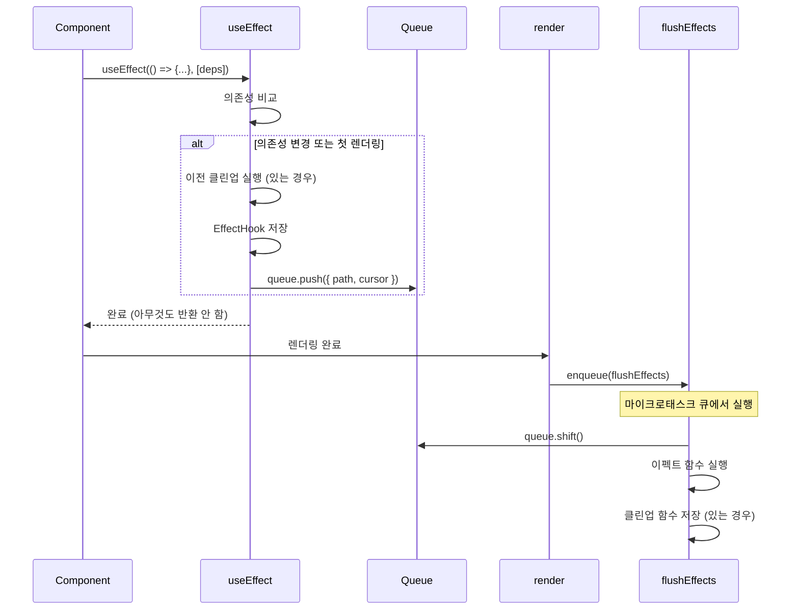
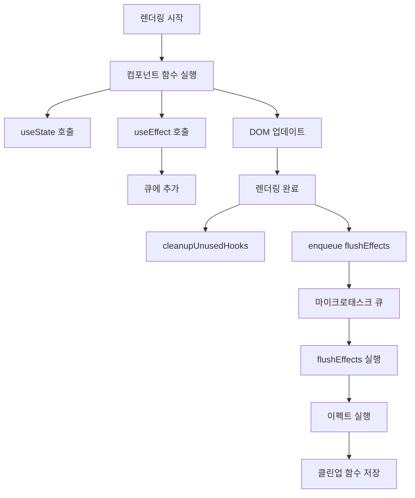

# useEffect 구현 학습 가이드

## 📖 학습 목표

- useEffect 훅의 내부 구조와 동작 방식을 이해하고 구현할 수 있다
- 의존성 배열 비교를 통한 조건부 실행 메커니즘을 이해하고 구현할 수 있다
- 렌더링 후 비동기로 이펙트를 실행하는 메커니즘을 이해하고 구현할 수 있다
- 이펙트 클린업 함수의 실행 시점과 메모리 누수 방지 메커니즘을 이해하고 구현할 수 있다

## 📚 핵심 개념

### 1. useEffect의 역할

`useEffect`는 컴포넌트의 사이드 이펙트를 처리하기 위한 훅입니다. DOM 조작, 데이터 페칭, 구독 설정 등 부수 효과를 처리합니다.

**특징**:
- 렌더링 후 비동기로 실행됨
- 의존성 배열이 변경될 때만 실행됨
- 클린업 함수를 반환하여 정리 작업 수행 가능

### 2. EffectHook 구조

```typescript
interface EffectHook {
  kind: HookType["EFFECT"];
  deps: unknown[] | null;              // 의존성 배열
  cleanup: (() => void) | null;        // 클린업 함수
  effect: () => (() => void) | void;   // 이펙트 함수
}
```

**EffectHook 필드**:
- `kind`: 훅 타입 식별자 (`HookTypes.EFFECT`)
- `deps`: 의존성 배열 (없으면 `null`)
- `cleanup`: 이전 실행에서 반환된 클린업 함수
- `effect`: 실행할 이펙트 함수

### 3. 이펙트 큐 시스템

이펙트는 렌더링 중에 큐에 추가되고, 렌더링 완료 후 비동기로 실행됩니다.

```typescript
interface EffectsContext {
  queue: Array<{ path: string; cursor: number }>;
}
```

**동작 원리**:
1. 렌더링 중: `useEffect`가 호출되면 큐에 `{ path, cursor }` 추가
2. 렌더링 완료: `render` 함수 끝에서 `flushEffects` 호출
3. 비동기 실행: `enqueue(flushEffects)`로 마이크로태스크 큐에 추가
4. 이펙트 실행: 큐를 순회하며 각 이펙트 실행

### 4. 의존성 배열 비교

의존성 배열이 변경되었는지 확인하기 위해 `shallowEquals` 함수를 사용합니다.

**shallowEquals 동작**:
- 같은 참조(`Object.is`)면 `true` 반환
- 배열인 경우: 길이가 같고 각 요소가 `Object.is`로 같으면 `true`
- 객체인 경우: 모든 키와 값이 `Object.is`로 같으면 `true`
- 1단계 깊이까지만 비교 (얕은 비교)

## 🔍 중요 포인트

### 1. 의존성 배열 비교를 통한 조건부 실행

이펙트는 의존성이 변경되었거나 첫 렌더링일 때만 실행됩니다.

**핵심 로직**:
```typescript
const prevHook = hooksForPath[cursor] as EffectHook | undefined;

// 의존성 배열 비교: 이전 훅이 없거나 의존성이 변경되었는지 확인
const shouldRunEffect =
  !prevHook || // 첫 렌더링
  !shallowEquals(prevHook.deps, deps); // 의존성 변경
```

**동작 원리**:
1. 이전 훅이 없으면 첫 렌더링이므로 실행
2. 이전 훅이 있으면 `shallowEquals`로 의존성 배열 비교
3. 의존성이 변경되었으면 실행, 같으면 실행하지 않음

**예시**:
```typescript
useEffect(() => {
  console.log("effect");
}, [count]);

// 첫 렌더링: prevHook이 없음 → 실행
// count가 1로 변경: prevDeps = [0], newDeps = [1] → 변경 감지 → 실행
// count가 1에서 1로 변경: prevDeps = [1], newDeps = [1] → 변경 없음 → 실행 안 함
```

### 2. 이전 클린업 함수 실행

이펙트가 재실행될 때 이전 클린업 함수를 먼저 실행합니다.

**핵심 로직**:
```typescript
// 4. 이전 클린업 함수가 있으면 먼저 실행합니다.
if (prevHook && prevHook.cleanup) {
  prevHook.cleanup();
}
```

**동작 원리**:
1. 이전 훅이 있고 클린업 함수가 있으면 실행
2. 클린업 함수는 이전 이펙트의 정리 작업을 수행
3. 메모리 누수 방지 및 리소스 정리

**예시**:
```typescript
useEffect(() => {
  const timer = setInterval(() => console.log("tick"), 1000);
  return () => clearInterval(timer);  // 클린업 함수
}, [count]);

// count가 변경되면:
// 1. 이전 클린업 함수 실행 (clearInterval)
// 2. 새 이펙트 실행 (setInterval)
```

### 3. 이펙트 큐에 추가 및 비동기 실행

이펙트는 렌더링 중에 큐에 추가되고, 렌더링 완료 후 비동기로 실행됩니다.

**핵심 로직**:
```typescript
// 5. 이펙트를 실행해야 하는 경우, 큐에 추가합니다.
if (shouldRunEffect) {
  // 이펙트 함수와 의존성 배열을 훅에 저장합니다.
  const hook: EffectHook = {
    kind: HookTypes.EFFECT,
    deps: deps ?? null,
    cleanup: null, // 실행 후 클린업 함수가 반환되면 여기에 저장됩니다.
    effect,
  };
  hooksForPath[cursor] = hook;

  // 이펙트 실행을 큐에 추가합니다 (렌더링 후 비동기로 실행됨)
  context.effects.queue.push({ path, cursor });
}
```

**렌더링 후 실행**:
```typescript
// render 함수에서
export const render = (): void => {
  // ... 렌더링 로직 ...
  cleanupUnusedHooks();
  
  // 4. 렌더링 후 큐에 쌓인 이펙트들을 비동기로 실행합니다.
  enqueue(flushEffects);
};
```

**동작 원리**:
1. 렌더링 중: `useEffect` 호출 시 큐에 `{ path, cursor }` 추가
2. 렌더링 완료: `render` 함수 끝에서 `enqueue(flushEffects)` 호출
3. 비동기 실행: 마이크로태스크 큐에서 `flushEffects` 실행
4. 이펙트 실행: 큐를 순회하며 각 이펙트 실행

### 4. flushEffects로 이펙트 실행

`flushEffects` 함수는 큐에 쌓인 이펙트들을 실행합니다.

**핵심 로직**:
```typescript
export const flushEffects = (): void => {
  // 큐에 있는 모든 이펙트를 실행합니다.
  while (context.effects.queue.length > 0) {
    const { path, cursor } = context.effects.queue.shift()!;

    // 해당 경로의 훅 상태 배열에서 이펙트 훅을 찾습니다.
    const hooksForPath = context.hooks.state.get(path);
    if (!hooksForPath) continue;

    const hook = hooksForPath[cursor] as EffectHook | undefined;
    if (!hook || hook.kind !== HookTypes.EFFECT) continue;

    // 이펙트 함수를 실행합니다.
    const cleanup = hook.effect();

    // 클린업 함수가 반환되면 훅에 저장합니다.
    if (typeof cleanup === "function") {
      hook.cleanup = cleanup;
    } else {
      hook.cleanup = null;
    }
  }
};
```

**동작 원리**:
1. 큐에서 `{ path, cursor }`를 하나씩 꺼냄
2. `path`와 `cursor`로 해당 훅을 찾음
3. 이펙트 함수 실행
4. 클린업 함수가 반환되면 훅에 저장

### 5. 언마운트 시 클린업 함수 실행

컴포넌트가 언마운트될 때 이펙트 클린업 함수를 실행합니다.

**언마운트 처리**:
```typescript
// reconcile 함수에서
if (!node) {
  if (instance) {
    // 컴포넌트가 언마운트될 때 이펙트 클린업 함수를 실행합니다.
    const instancePath = instance.path;
    const hooksForPath = context.hooks.state.get(instancePath);
    if (hooksForPath) {
      hooksForPath.forEach((hook) => {
        if (hook.kind === HookTypes.EFFECT) {
          const effectHook = hook as EffectHook;
          if (effectHook.cleanup && typeof effectHook.cleanup === "function") {
            effectHook.cleanup();
          }
        }
      });
    }
    removeInstance(parentDom, instance);
  }
  return null;
}
```

**cleanupUnusedHooks에서 처리**:
```typescript
export const cleanupUnusedHooks = () => {
  for (const [path, hooks] of context.hooks.state.entries()) {
    if (!context.hooks.visited.has(path)) {
      // 이펙트 클린업 함수 실행
      hooks.forEach((hook) => {
        if (hook.kind === HookTypes.EFFECT) {
          const effectHook = hook as EffectHook;
          if (effectHook.cleanup && typeof effectHook.cleanup === "function") {
            effectHook.cleanup();
          }
        }
      });
      
      // 훅 상태 삭제
      context.hooks.state.delete(path);
      context.hooks.cursor.delete(path);
    }
  }
};
```

**동작 원리**:
- 컴포넌트가 언마운트되면 (`node === null`) 해당 path의 모든 이펙트 클린업 함수 실행
- `cleanupUnusedHooks`에서 `visited`에 없는 path의 이펙트 클린업 함수 실행
- 메모리 누수 방지 및 리소스 정리

## 💡 실전 예제

### 예제 1: 기본 useEffect 사용

```typescript
function Counter() {
  const [count, setCount] = useState(0);
  
  useEffect(() => {
    console.log("Effect executed:", count);
  });
  
  return (
    <div>
      <p>Count: {count}</p>
      <button onClick={() => setCount(count + 1)}>Increment</button>
    </div>
  );
}
```

**동작 과정**:
1. **마운트**: `useEffect` 호출 → 큐에 추가
2. **렌더링 완료**: `flushEffects` 실행 → "Effect executed: 0" 출력
3. **버튼 클릭**: `count` 업데이트 → `useEffect` 재호출 → 큐에 추가
4. **렌더링 완료**: `flushEffects` 실행 → "Effect executed: 1" 출력

### 예제 2: 의존성 배열 사용

```typescript
function UserProfile({ userId }: { userId: string }) {
  const [user, setUser] = useState<User | null>(null);
  
  useEffect(() => {
    fetchUser(userId).then(setUser);
  }, [userId]);
  
  return <div>{user?.name}</div>;
}
```

**동작 과정**:
1. **마운트**: `userId`가 "123" → 이펙트 실행 → `fetchUser("123")` 호출
2. **userId 변경**: `userId`가 "456"으로 변경 → 의존성 변경 감지 → 이펙트 재실행 → `fetchUser("456")` 호출
3. **userId 동일**: `userId`가 "456"에서 "456"으로 유지 → 의존성 변경 없음 → 이펙트 실행 안 함

### 예제 3: 클린업 함수 사용

```typescript
function Timer() {
  const [seconds, setSeconds] = useState(0);
  
  useEffect(() => {
    const interval = setInterval(() => {
      setSeconds(prev => prev + 1);
    }, 1000);
    
    return () => clearInterval(interval);  // 클린업 함수
  }, []);
  
  return <div>Seconds: {seconds}</div>;
}
```

**동작 과정**:
1. **마운트**: 이펙트 실행 → `setInterval` 설정 → 클린업 함수 반환
2. **언마운트**: 컴포넌트 제거 → 클린업 함수 실행 → `clearInterval` 호출 → 타이머 정리

## 🎨 시각적 자료

### useEffect 실행 플로우



### 이펙트 실행 시점



## 📌 요약

### 핵심 원칙

1. **의존성 기반 실행**: 의존성 배열이 변경되었거나 첫 렌더링일 때만 실행
2. **비동기 실행**: 렌더링 완료 후 마이크로태스크 큐에서 실행
3. **클린업 함수**: 이펙트 재실행 전 또는 언마운트 시 클린업 함수 실행
4. **메모리 누수 방지**: 언마운트 시 클린업 함수 실행으로 리소스 정리

### 구현 포인트

- `EffectHook`: `deps`, `cleanup`, `effect` 저장
- `context.effects.queue`: 실행할 이펙트 목록 (`{ path, cursor }`)
- `shallowEquals`: 의존성 배열 비교 (얕은 비교)
- `flushEffects`: 큐를 순회하며 이펙트 실행
- `enqueue(flushEffects)`: 마이크로태스크 큐에 추가하여 비동기 실행

### 학습 효과

이 학습을 마친 후, useEffect 훅의 내부 구조와 동작 방식을 이해하고, 의존성 배열 비교를 통한 조건부 실행과 렌더링 후 비동기 실행 메커니즘을 구현할 수 있습니다.

