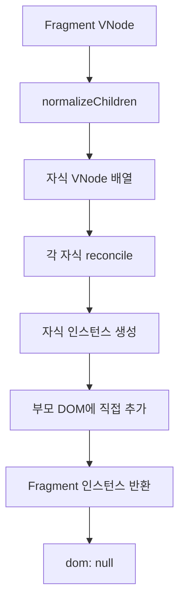
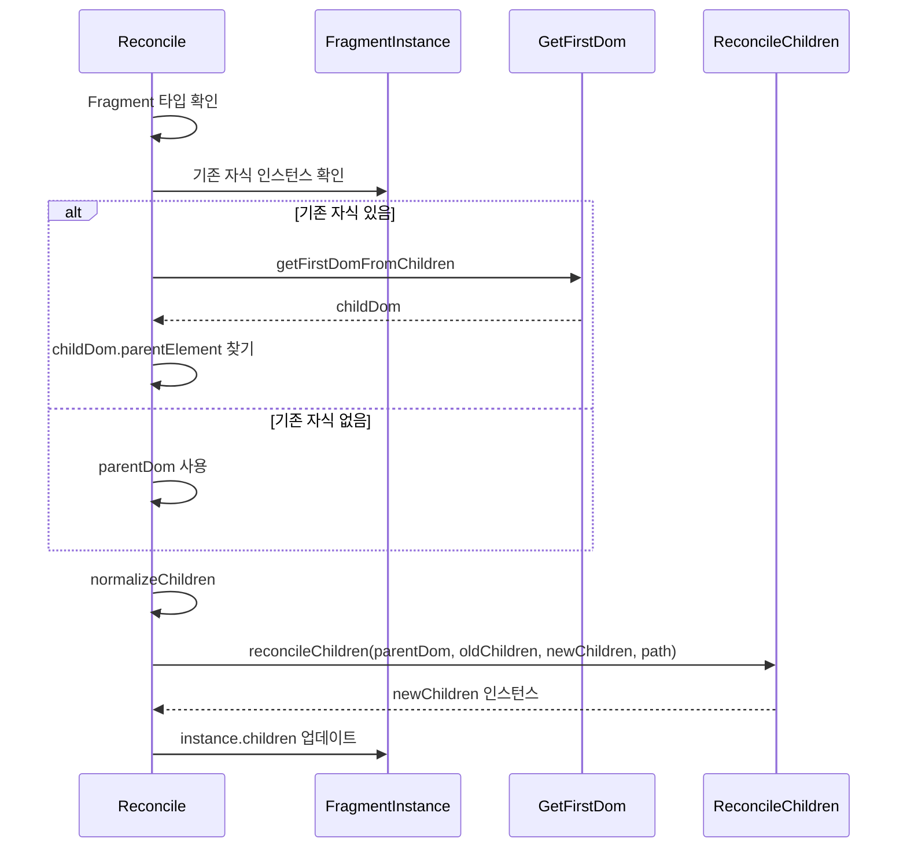
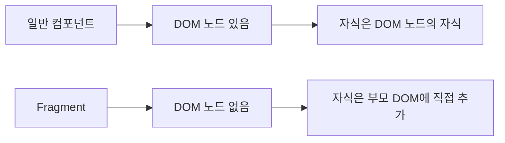

# Fragment 업데이트 처리 학습 가이드

## 📖 학습 목표

- Fragment의 특성을 이해하고 자체 DOM이 없는 이유를 파악할 수 있다
- Fragment 업데이트 시 자식 재조정 메커니즘을 이해하고 구현할 수 있다
- Fragment의 부모 DOM 찾기 로직을 이해하고 구현할 수 있다
- 조건부 자식 렌더링 시 Fragment가 올바르게 업데이트되도록 구현할 수 있다

## 📚 핵심 개념

### 1. Fragment란?

Fragment는 여러 자식 요소를 래핑하지 않고 그룹화하기 위한 특수한 컴포넌트입니다.

**특징**:
- 자체 DOM 노드가 없음 (`dom: null`)
- 자식 요소들만 DOM에 직접 추가됨
- JSX에서 `<>...</>` 또는 `<Fragment>...</Fragment>`로 사용

**예시**:
```typescript
// Fragment 사용
function Component() {
  return (
    <>
      <div>Item 1</div>
      <div>Item 2</div>
    </>
  );
}

// 결과 DOM 구조:
// <div>Item 1</div>
// <div>Item 2</div>
// (Fragment 자체는 DOM에 없음)
```

### 2. Fragment와 일반 컴포넌트의 차이

**일반 DOM 요소**:
```typescript
<div>
  <span>Child</span>
</div>
```
- `<div>`는 실제 DOM 노드를 가짐
- 자식은 `<div>`의 자식으로 추가됨

**Fragment**:
```typescript
<>
  <span>Child 1</span>
  <span>Child 2</span>
</>
```
- Fragment는 DOM 노드가 없음
- 자식들은 Fragment의 부모 DOM에 직접 추가됨

### 3. Fragment의 마운트 처리

Fragment는 마운트 시 자식들만 처리합니다.

```typescript
// mountNode 함수에서
if (node.type === Fragment) {
  const childNodes = normalizeChildren(node.props.children);
  const children = childNodes.map((childVNode, index) =>
    reconcile(parentDom, null, childVNode, createChildPath(path, childVNode.key ?? null, index)),
  );

  return {
    kind: NodeTypes.FRAGMENT,
    dom: null,  // Fragment는 DOM이 없음
    node,
    children,
    key: node.key,
    path,
  };
}
```

**동작 원리**:
1. Fragment의 자식 VNode 배열을 정규화
2. 각 자식을 `reconcile`하여 인스턴스 생성
3. `parentDom`에 직접 추가 (Fragment는 DOM이 없으므로)
4. Fragment 인스턴스 반환 (자체 DOM은 null)

### 4. Fragment의 업데이트 처리 (누락된 부분)

기존에는 Fragment 타입의 업데이트 처리가 누락되어 있었습니다.

**처리되는 타입**:
- ✅ `TEXT_ELEMENT` - 텍스트 노드 업데이트
- ✅ `string` - 일반 DOM 요소 업데이트
- ✅ `function` - 함수형 컴포넌트 업데이트
- ❌ `Fragment` - Fragment 업데이트 (누락)

**문제 상황**:
```typescript
function Dynamic({ visible }: { visible: boolean }) {
  return <>{visible && <p id="dynamic">dynamic</p>}</>;
}

// visible이 false → true로 변경되면
// Fragment에 자식이 추가되어야 하는데 업데이트되지 않음 ❌
```

## 🔍 중요 포인트

### 1. Fragment 업데이트 처리 추가

Fragment는 자체 DOM이 없으므로, 자식들을 재조정할 때 부모 DOM을 사용해야 합니다.

**핵심 로직**:
```typescript
// Fragment 업데이트
if (nextNode.type === Fragment) {
  // Fragment는 자체 DOM이 없으므로, 자식들을 재조정할 때 부모 DOM을 사용해야 합니다
  // 기존 자식 인스턴스가 있으면 그 DOM의 부모를 찾아서 사용하고, 없으면 parentDom을 사용
  const existingChildInstance = instance.children?.[0];
  let childParentDom = parentDom;

  if (existingChildInstance) {
    // 자식 인스턴스의 첫 번째 DOM 노드를 찾음
    const childDom = getFirstDomFromChildren([existingChildInstance]);
    if (childDom) {
      // DOM 노드의 부모 요소를 찾음 (Text 노드인 경우도 처리)
      // parentElement는 HTMLElement만 반환하므로, Text 노드의 경우 parentNode를 사용
      if (childDom.parentElement) {
        childParentDom = childDom.parentElement;
      } else if (childDom.parentNode && childDom.parentNode instanceof HTMLElement) {
        childParentDom = childDom.parentNode;
      }
    }
  }

  // Fragment의 자식들을 재조정합니다
  const childNodes = normalizeChildren(nextNode.props.children);
  instance.children = reconcileChildren(childParentDom, instance.children || [], childNodes, path);
  instance.node = nextNode;
  return instance;
}
```

**동작 원리**:
1. 기존 자식 인스턴스가 있으면 그 DOM의 부모를 찾아서 사용
2. 없으면 `parentDom` 사용
3. `normalizeChildren`로 자식 VNode 배열 정규화
4. `reconcileChildren`으로 자식 인스턴스 재조정

### 2. 부모 DOM 찾기 로직

Fragment는 자체 DOM이 없으므로, 자식을 추가할 위치를 찾기 위해 부모 DOM을 찾아야 합니다.

**경우 1: 기존 자식이 있는 경우**:
```typescript
if (existingChildInstance) {
  const childDom = getFirstDomFromChildren([existingChildInstance]);
  if (childDom) {
    if (childDom.parentElement) {
      childParentDom = childDom.parentElement;
    } else if (childDom.parentNode && childDom.parentNode instanceof HTMLElement) {
      childParentDom = childDom.parentNode;
    }
  }
}
```

**동작 원리**:
- 기존 자식 인스턴스의 첫 DOM 노드를 찾음
- 그 DOM 노드의 부모를 찾아서 사용
- `parentElement`는 HTMLElement만 반환하므로, Text 노드인 경우 `parentNode` 사용

**경우 2: 기존 자식이 없는 경우**:
```typescript
let childParentDom = parentDom;  // 기본값
```

첫 마운트이거나 자식이 없는 경우 `parentDom`을 사용합니다.

### 3. 조건부 자식 렌더링 처리

Fragment의 조건부 자식 렌더링이 올바르게 처리되어야 합니다.

**예시**:
```typescript
function Dynamic({ visible }: { visible: boolean }) {
  return <>{visible && <p id="dynamic">dynamic</p>}</>;
}

// 초기: visible = false → Fragment 자식 없음
// 업데이트: visible = true → Fragment에 <p> 추가
```

**처리 과정**:
1. **초기 렌더링**: `visible = false` → `normalizeChildren` 결과 빈 배열
2. **Fragment 마운트**: 자식 없음 → `instance.children = []`
3. **업데이트**: `visible = true` → `normalizeChildren` 결과 `[<p>]`
4. **Fragment 업데이트**: `reconcileChildren` 호출하여 새 자식 추가
5. **DOM 업데이트**: `<p id="dynamic">dynamic</p>`가 부모 DOM에 추가됨

## 💡 실전 예제

### 예제 1: 기본 Fragment 사용

```typescript
function Items() {
  return (
    <>
      <li>Item 1</li>
      <li>Item 2</li>
    </>
  );
}
```

**DOM 구조**:
```
<ul>
  <li>Item 1</li>
  <li>Item 2</li>
</ul>
```

Fragment는 DOM에 나타나지 않고, 자식들만 추가됩니다.

### 예제 2: 조건부 자식 렌더링

```typescript
function Dynamic({ visible }: { visible: boolean }) {
  return <>{visible && <p id="dynamic">dynamic</p>}</>;
}

function Sample() {
  const [visible, update] = useState(false);
  return (
    <div>
      <span id="static">static</span>
      <Dynamic visible={visible} />
      <ul id="list">
        <li id="first">first</li>
        <li id="second">second</li>
      </ul>
    </div>
  );
}
```

**초기 렌더링** (`visible = false`):
- Fragment 자식: `[]` (빈 배열)
- DOM: `<span>static</span><ul>...</ul>`

**업데이트 후** (`visible = true`):
- Fragment 자식: `[<p id="dynamic">]`
- DOM: `<span>static</span><p id="dynamic">dynamic</p><ul>...</ul>`
- 기존 DOM 요소들(`#static`, `#list`, `#first`, `#second`)은 유지되어야 함

### 예제 3: Fragment 중첩

```typescript
function Wrapper() {
  return (
    <>
      <div>Header</div>
      <>
        <span>Nested 1</span>
        <span>Nested 2</span>
      </>
      <div>Footer</div>
    </>
  );
}
```

**DOM 구조**:
```
<div>Header</div>
<span>Nested 1</span>
<span>Nested 2</span>
<div>Footer</div>
```

중첩된 Fragment도 자체 DOM 없이 자식들만 추가됩니다.

## 🎨 시각적 자료

### Fragment 마운트 플로우



### Fragment 업데이트 플로우



### Fragment vs 일반 컴포넌트



## 📌 요약

### 핵심 원칙

1. **자체 DOM 없음**: Fragment는 DOM 노드를 생성하지 않고, 자식들만 부모 DOM에 직접 추가합니다.
2. **부모 DOM 찾기**: 자식을 재조정할 때는 기존 자식의 부모 DOM을 찾아서 사용하거나, 없으면 `parentDom`을 사용합니다.
3. **자식 재조정**: `reconcileChildren` 함수를 사용하여 Fragment의 자식들을 재조정합니다.
4. **조건부 렌더링 지원**: Fragment의 조건부 자식 렌더링이 올바르게 처리되어야 합니다.

### 구현 포인트

- Fragment 업데이트 처리: `reconcile` 함수에 Fragment 업데이트 로직 추가
- 부모 DOM 찾기: `getFirstDomFromChildren`로 기존 자식의 DOM 찾기 → 부모 DOM 추출
- 자식 재조정: `normalizeChildren` + `reconcileChildren`으로 자식 업데이트
- 인스턴스 갱신: `instance.node`와 `instance.children` 업데이트

### 학습 효과

이 학습을 마친 후, Fragment의 특성을 이해하고 조건부 자식 렌더링 시 Fragment가 올바르게 업데이트되도록 구현할 수 있습니다.

