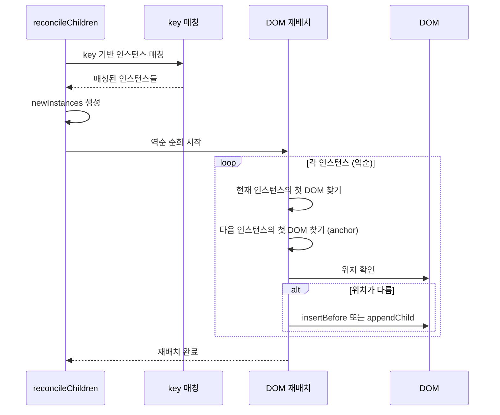
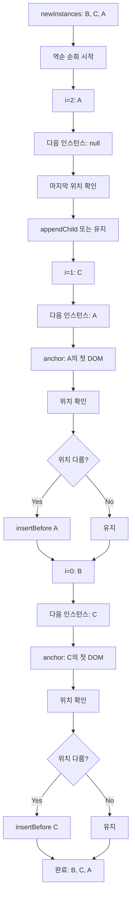

# key 기반 DOM 재배치 처리 학습 가이드

## 📖 학습 목표

- key 기반 인스턴스 매칭 메커니즘을 이해하고 구현할 수 있다
- key가 있는 자식을 재배치할 때 DOM 순서를 올바르게 업데이트하는 메커니즘을 이해하고 구현할 수 있다
- 역순 순회를 사용한 효율적인 DOM 재배치 알고리즘을 이해하고 구현할 수 있다
- anchor를 사용한 DOM 삽입 전략을 이해하고 구현할 수 있다

## 📚 핵심 개념

### 1. key 기반 Reconciliation

key는 React에서 리스트 항목을 식별하는 데 사용되는 고유 식별자입니다. key를 사용하면 항목이 이동하거나 추가/제거될 때 React가 어떤 항목이 변경되었는지 효율적으로 추적할 수 있습니다.

**key의 역할**:
- 항목 식별: 같은 key를 가진 항목은 같은 컴포넌트로 인식
- 상태 보존: 같은 key를 가진 항목은 상태를 보존
- DOM 재사용: 같은 key를 가진 항목은 DOM을 재사용

**예시**:
```typescript
function List({ items }: { items: Item[] }) {
  return (
    <ul>
      {items.map(item => (
        <li key={item.id}>{item.label}</li>
      ))}
    </ul>
  );
}
```

### 2. key 기반 인스턴스 매칭

key가 있는 경우, key를 기준으로 기존 인스턴스를 매칭합니다.

**매칭 로직**:
```typescript
// key가 있는 경우: key로 매칭
const keyedInstances = new Map<string, Instance | undefined>();
const unkeyedInstances: (Instance | undefined)[] = [];

// 기존 인스턴스를 key/인덱스로 분류
oldChildren.forEach((oldChild, index) => {
  if (oldChild?.node.key !== undefined) {
    keyedInstances.set(oldChild.node.key, oldChild);
  } else {
    unkeyedInstances[index] = oldChild;
  }
});

// 새 VNode와 매칭
if (childVNode.key !== undefined) {
  matchedInstance = keyedInstances.get(childVNode.key);
  if (matchedInstance) {
    keyedInstances.delete(childVNode.key);  // 사용된 인스턴스 제거
  }
}
```

**동작 원리**:
1. 기존 인스턴스를 key/인덱스로 분류
2. key가 있으면 key로 매칭, 없으면 인덱스로 매칭
3. 매칭된 인스턴스를 재사용하여 상태 보존
4. 매칭되지 않은 인스턴스는 새로 마운트

### 3. DOM 순서 재배치 문제

key 기반 매칭은 올바르게 작동하지만, DOM 순서 재배치 로직이 누락되어 있었습니다.

**문제 상황**:
```typescript
// 초기: [A, B, C]
// 재배치: [B, C, A] (첫 번째 항목을 마지막으로 이동)

// 기대: DOM 순서도 [B, C, A]가 되어야 함
// 실제: DOM 순서가 [A, B, C]로 유지됨 ❌
```

**원인 분석**:
- ✅ key 기반 인스턴스 매칭: 올바르게 작동
- ✅ 인스턴스 재사용: 올바르게 작동
- ❌ DOM 순서 재배치: 누락됨

**해결 필요**:
- 인스턴스 순서와 DOM 순서를 일치시켜야 함
- DOM 노드를 물리적으로 이동시켜야 함

### 4. 역순 순회를 사용한 DOM 재배치

역순으로 순회하면 다음 인스턴스의 첫 DOM 노드를 anchor로 사용할 수 있어 효율적입니다.

**핵심 로직**:
```typescript
// 5. DOM 순서 재배치: 역순으로 순회하여 올바른 위치에 DOM 배치
// 역순으로 순회하면 다음 인스턴스의 첫 DOM 노드를 anchor로 사용할 수 있어 효율적입니다
for (let i = newInstances.length - 1; i >= 0; i--) {
  const instance = newInstances[i];
  if (!instance) continue;

  // 현재 인스턴스의 첫 DOM 노드 찾기
  const currentFirstDom = getFirstDomFromChildren([instance]);
  if (!currentFirstDom) continue;

  // 다음 인스턴스의 첫 DOM 노드를 anchor로 사용
  const nextInstance = i + 1 < newInstances.length ? newInstances[i + 1] : null;
  const nextFirstDom = nextInstance ? getFirstDomFromChildren([nextInstance]) : null;

  // 현재 DOM이 올바른 위치에 있는지 확인
  if (nextFirstDom) {
    // anchor 앞에 있어야 하는데 현재 위치가 다르면 재배치
    if (currentFirstDom.nextSibling !== nextFirstDom) {
      // DOM 노드들을 anchor 앞에 삽입
      const domNodes = getDomNodes(instance);
      domNodes.forEach((node) => {
        parentDom.insertBefore(node, nextFirstDom);
      });
    }
  } else {
    // anchor가 없으면 마지막 위치에 있어야 함
    if (currentFirstDom.nextSibling !== null) {
      // DOM 노드들을 마지막에 삽입
      const domNodes = getDomNodes(instance);
      domNodes.forEach((node) => {
        parentDom.appendChild(node);
      });
    }
  }
}
```

**동작 원리**:
1. **역순 순회**: 마지막 인스턴스부터 첫 번째 인스턴스까지 역순으로 순회
2. **Anchor 찾기**: 다음 인스턴스(i + 1)의 첫 DOM 노드를 anchor로 사용
3. **위치 확인**: 현재 인스턴스의 첫 DOM 노드가 anchor의 바로 앞에 있는지 확인
4. **재배치**: 위치가 다르면 DOM 노드들을 올바른 위치에 삽입

### 5. 역순 순회를 사용하는 이유

**정순 순회의 문제**:
- 이전 인스턴스를 anchor로 사용하려면 이미 처리된 인스턴스의 위치를 기억해야 함
- 복잡하고 비효율적

**역순 순회의 장점**:
- 다음 인스턴스(아직 처리되지 않음)를 anchor로 사용
- 각 인스턴스의 첫 DOM 노드를 anchor로 사용하면 간단하고 효율적
- 이미 처리된 인스턴스의 위치를 기억할 필요 없음

**예시**:
```typescript
// 순서: [B, C, A]
// 역순 순회: i = 2 (A), 1 (C), 0 (B)

// i = 2 (A):
//   nextInstance = null (없음)
//   anchor = null
//   마지막 위치 확인 → appendChild

// i = 1 (C):
//   nextInstance = A (이미 처리됨)
//   anchor = A의 첫 DOM 노드
//   C를 A 앞에 삽입 → insertBefore(A의 첫 DOM 노드)

// i = 0 (B):
//   nextInstance = C (이미 처리됨)
//   anchor = C의 첫 DOM 노드
//   B를 C 앞에 삽입 → insertBefore(C의 첫 DOM 노드)
```

## 🔍 중요 포인트

### 1. key 기반 인스턴스 매칭

key가 있는 경우, key를 기준으로 기존 인스턴스를 매칭하여 상태를 보존합니다.

**구현 포인트**:
- `keyedInstances`: `Map<key, Instance>`로 key별 인스턴스 저장
- `unkeyedInstances`: 배열로 인덱스별 인스턴스 저장
- `matchedInstance`: key로 매칭된 인스턴스 또는 `null`

**핵심 원칙**:
- 같은 key를 가진 항목은 같은 인스턴스로 인식
- 인스턴스를 재사용하여 상태 보존
- DOM 재사용을 통한 성능 최적화

### 2. DOM 순서 재배치 로직 추가

key 기반 매칭 후 DOM 순서를 재배치하여 인스턴스 순서와 일치시킵니다.

**구현 포인트**:
- `newInstances` 배열을 역순으로 순회
- 각 인스턴스의 첫 DOM 노드를 찾기
- 다음 인스턴스의 첫 DOM 노드를 anchor로 사용
- 위치가 다르면 `insertBefore` 또는 `appendChild`로 재배치

**핵심 원칙**:
- 인스턴스 순서와 DOM 순서를 일치시킴
- DOM 노드를 물리적으로 이동시켜 순서 반영
- 기존 DOM 노드를 재사용하여 성능 최적화

### 3. 역순 순회 알고리즘

역순으로 순회하면 다음 인스턴스의 첫 DOM 노드를 anchor로 사용할 수 있어 효율적입니다.

**알고리즘 단계**:
1. `newInstances` 배열을 역순으로 순회 (i = length - 1부터 0까지)
2. 현재 인스턴스의 첫 DOM 노드 찾기
3. 다음 인스턴스(i + 1)의 첫 DOM 노드를 anchor로 사용
4. 현재 DOM이 anchor의 바로 앞에 있는지 확인
5. 위치가 다르면 `insertBefore`로 재배치

**효율성**:
- 각 인스턴스의 첫 DOM 노드만 찾으면 됨
- 이미 처리된 인스턴스의 위치를 기억할 필요 없음
- O(n) 시간 복잡도로 효율적

### 4. Anchor 기반 DOM 삽입

anchor를 사용하여 DOM 노드를 올바른 위치에 삽입합니다.

**Anchor 사용 전략**:
- 다음 인스턴스의 첫 DOM 노드를 anchor로 사용
- `insertBefore(anchor)`로 anchor 앞에 삽입
- anchor가 없으면 마지막 위치에 `appendChild`

**동작 원리**:
```typescript
if (nextFirstDom) {
  // anchor 앞에 있어야 하는데 현재 위치가 다르면 재배치
  if (currentFirstDom.nextSibling !== nextFirstDom) {
    parentDom.insertBefore(node, nextFirstDom);
  }
} else {
  // anchor가 없으면 마지막 위치에 있어야 함
  if (currentFirstDom.nextSibling !== null) {
    parentDom.appendChild(node);
  }
}
```

### 5. DOM 재사용 및 성능 최적화

key 기반 매칭과 DOM 재배치를 통해 DOM 노드를 재사용합니다.

**성능 최적화**:
- 같은 key를 가진 항목은 DOM을 재사용
- 불필요한 DOM 생성/삭제 최소화
- DOM 순서만 변경하여 성능 향상

**주의 사항**:
- DOM 노드를 이동시키는 것보다 새로 생성하는 것이 더 빠를 수 있음
- 하지만 상태 보존과 사용자 경험을 위해 재사용하는 것이 중요

## 💡 실전 예제

### 예제 1: 기본 key 기반 리스트

```typescript
function List({ items }: { items: Item[] }) {
  return (
    <ul>
      {items.map(item => (
        <li key={item.id}>{item.label}</li>
      ))}
    </ul>
  );
}

// 초기: items = [{id: "a", label: "A"}, {id: "b", label: "B"}, {id: "c", label: "C"}]
// DOM: <li>A</li><li>B</li><li>C</li>

// 재배치: items = [{id: "b", label: "B"}, {id: "c", label: "C"}, {id: "a", label: "A"}]
// DOM: <li>B</li><li>C</li><li>A</li> (순서 변경)
```

### 예제 2: 첫 번째 항목을 마지막으로 이동

```typescript
function List() {
  const [items, setItems] = useState([
    { id: "a", label: "A" },
    { id: "b", label: "B" },
    { id: "c", label: "C" },
  ]);
  
  const reorder = () => {
    setItems(([first, ...rest]) => [...rest, first]);
  };
  
  return (
    <ul>
      {items.map(item => (
        <li key={item.id}>{item.label}</li>
      ))}
    </ul>
  );
}

// 초기: [A, B, C]
// DOM: <li>A</li><li>B</li><li>C</li>

// reorder() 호출 후: [B, C, A]
// DOM: <li>B</li><li>C</li><li>A</li> (A가 마지막으로 이동)
```

**재배치 과정**:
1. **key 기반 매칭**: 
   - A: key "a" → 기존 인스턴스 재사용
   - B: key "b" → 기존 인스턴스 재사용
   - C: key "c" → 기존 인스턴스 재사용

2. **DOM 재배치**:
   - i = 2 (A): 다음 인스턴스 없음 → 마지막 위치 확인 → `appendChild`
   - i = 1 (C): 다음 인스턴스 = A → C를 A 앞에 삽입 → `insertBefore(A)`
   - i = 0 (B): 다음 인스턴스 = C → B를 C 앞에 삽입 → `insertBefore(C)`

3. **최종 결과**: [B, C, A] 순서로 DOM 재배치 완료

### 예제 3: 중간 항목 제거

```typescript
// 초기: [A, B, C, D]
// DOM: <li>A</li><li>B</li><li>C</li><li>D</li>

// B 제거: [A, C, D]
// DOM: <li>A</li><li>C</li><li>D</li>
```

**재배치 과정**:
1. B 인스턴스는 매칭되지 않아 제거
2. C, D는 자동으로 앞으로 이동 (재배치 필요 없음)
3. DOM 재배치 로직은 불필요 (이미 올바른 순서)

## 🎨 시각적 자료

### DOM 재배치 플로우



### 역순 순회 예시



## 📌 요약

### 핵심 원칙

1. **key 기반 매칭**: 같은 key를 가진 항목은 같은 인스턴스로 인식하여 상태 보존
2. **DOM 재배치**: 인스턴스 순서와 DOM 순서를 일치시키기 위해 DOM 노드를 물리적으로 이동
3. **역순 순회**: 다음 인스턴스의 첫 DOM 노드를 anchor로 사용하여 효율적인 재배치
4. **DOM 재사용**: 같은 key를 가진 항목은 DOM을 재사용하여 성능 최적화

### 구현 포인트

- `keyedInstances`: key별 인스턴스 저장 (`Map<key, Instance>`)
- `newInstances`: 재조정된 인스턴스 배열
- 역순 순회: 마지막 인스턴스부터 첫 번째 인스턴스까지
- anchor 기반 삽입: 다음 인스턴스의 첫 DOM 노드를 anchor로 사용
- `insertBefore` / `appendChild`: DOM 노드를 올바른 위치에 삽입

### 학습 효과

이 학습을 마친 후, key 기반 인스턴스 매칭과 DOM 재배치 메커니즘을 이해하고, key가 있는 자식을 재배치할 때 DOM 순서를 올바르게 업데이트하는 로직을 구현할 수 있습니다.

