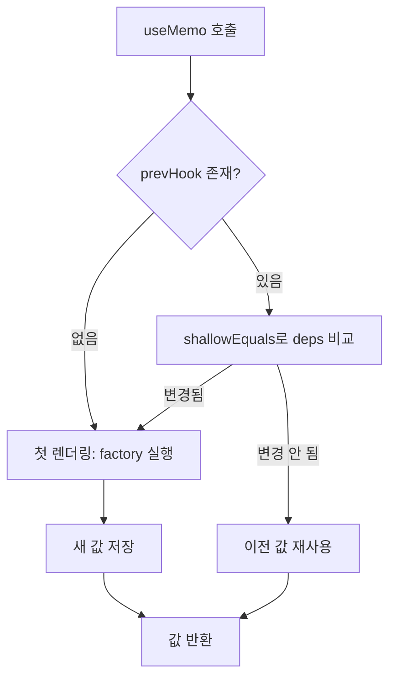
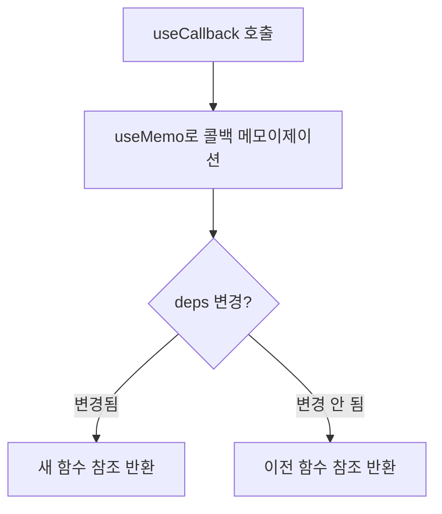
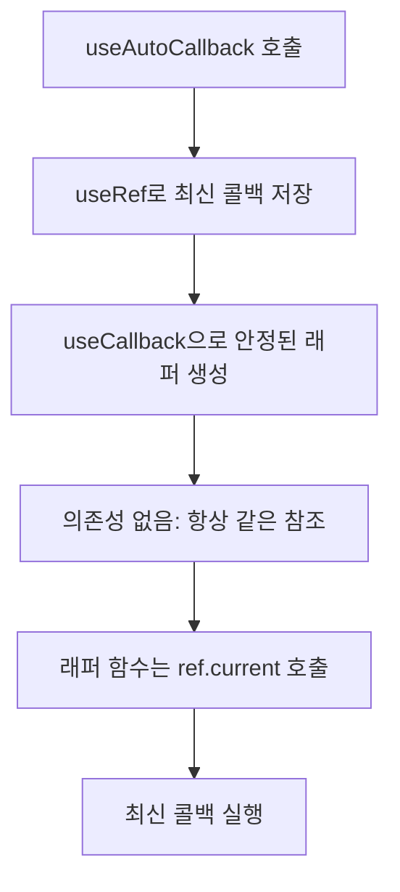

# 추가 Hooks 구현 학습 가이드

## 📖 학습 목표

- `useRef` 훅의 내부 구조와 lazy initializer 패턴을 이해하고 구현할 수 있다
- `useMemo` 훅의 메모이제이션 메커니즘을 이해하고 구현할 수 있다
- `useCallback` 훅의 콜백 메모이제이션 메커니즘을 이해하고 구현할 수 있다
- `useDeepMemo` 훅의 깊은 비교 메모이제이션을 이해하고 구현할 수 있다
- `useAutoCallback` 훅의 안정된 참조 패턴을 이해하고 구현할 수 있다

## 📚 핵심 개념

### 1. useRef 구현

`useRef`는 렌더링 간에도 값을 유지하면서 리렌더링을 트리거하지 않는 훅입니다.

#### 핵심 특징

- **값 보존**: 리렌더링 간에도 같은 참조 유지
- **리렌더링 없음**: 값 변경 시 리렌더링 트리거 안 함
- **Lazy Initializer**: 초기값은 최초 한 번만 평가

#### 구현 방식

```typescript
export const useRef = <T>(initialValue: T | (() => T)): { current: T } => {
  const path = context.hooks.currentPath;
  const cursor = context.hooks.currentCursor;

  if (!context.hooks.state.has(path)) {
    context.hooks.state.set(path, []);
  }

  const hooksForPath = context.hooks.state.get(path)!;
  let hook = hooksForPath[cursor] as RefHook<T> | undefined;

  if (!hook) {
    // 최초 실행: 초기값 평가
    const value = typeof initialValue === "function" 
      ? (initialValue as () => T)() 
      : initialValue;
    
    hook = {
      kind: HookTypes.REF,
      current: value,
    };
    hooksForPath[cursor] = hook;
  }

  context.hooks.cursor.set(path, cursor + 1);
  return hook;
};
```

#### 동작 원리

1. **첫 렌더링**: `hook`이 없으면 초기값으로 생성
   - 함수형 이니셜라이저인 경우 한 번만 실행
   - 생성된 객체를 훅 배열에 저장
2. **재렌더링**: 기존 `hook` 재사용
   - 같은 참조를 반환하여 값 보존
   - `current` 속성 변경은 리렌더링 트리거 안 함

#### 사용 예시

```typescript
function Component() {
  const countRef = useRef(0);
  
  // 리렌더링 없이 값 변경
  countRef.current = 10;
  
  // 렌더링 간 값 보존
  console.log(countRef.current); // 항상 최신 값
}
```

---

### 2. useMemo 구현

`useMemo`는 의존성이 변경될 때만 factory 함수를 재실행하여 값을 메모이제이션합니다.

#### 핵심 특징

- **의존성 기반 재계산**: 의존성이 변경될 때만 factory 재실행
- **값 캐싱**: 이전 값과 의존성을 저장하여 재사용
- **얕은 비교**: `shallowEquals`로 의존성 비교

#### 구현 방식

```typescript
export const useMemo = <T>(
  factory: () => T,
  deps: unknown[] | null
): T => {
  const path = context.hooks.currentPath;
  const cursor = context.hooks.currentCursor;

  if (!context.hooks.state.has(path)) {
    context.hooks.state.set(path, []);
  }

  const hooksForPath = context.hooks.state.get(path)!;
  const prevHook = hooksForPath[cursor] as MemoHook<T> | undefined;

  // 의존성 비교
  const shouldRecalculate =
    !prevHook || // 첫 렌더링
    !shallowEquals(prevHook.deps, deps); // 의존성 변경

  if (shouldRecalculate) {
    const value = factory();
    const hook: MemoHook<T> = {
      kind: HookTypes.MEMO,
      value,
      deps: deps ?? null,
    };
    hooksForPath[cursor] = hook;
    context.hooks.cursor.set(path, cursor + 1);
    return value;
  }

  // 의존성이 변경되지 않았으면 이전 값 재사용
  context.hooks.cursor.set(path, cursor + 1);
  return prevHook.value;
};
```

#### 동작 원리

1. **첫 렌더링**: `prevHook`이 없으면 factory 실행하여 값 생성
2. **의존성 비교**: `shallowEquals`로 이전 deps와 현재 deps 비교
3. **재계산 결정**: 의존성이 변경되었으면 factory 재실행, 같으면 이전 값 재사용

#### 사용 예시

```typescript
function Component({ items }: { items: Item[] }) {
  // items가 변경될 때만 정렬 수행
  const sortedItems = useMemo(() => {
    return items.sort((a, b) => a.id - b.id);
  }, [items]);
  
  return <div>{sortedItems.map(item => <Item key={item.id} />)}</div>;
}
```

---

### 3. useCallback 구현

`useCallback`은 콜백 함수의 참조를 메모이제이션하여 불필요한 재생성을 방지합니다.

#### 핵심 특징

- **참조 안정성**: 의존성이 같으면 같은 함수 참조 반환
- **useMemo 활용**: 내부적으로 `useMemo`를 사용하여 구현
- **자식 컴포넌트 최적화**: props로 전달할 때 유용

#### 구현 방식

```typescript
export const useCallback = <T extends (...args: any[]) => any>(
  callback: T,
  deps: unknown[] | null
): T => {
  return useMemo(() => callback, deps) as T;
};
```

#### 동작 원리

1. `useMemo`를 사용하여 콜백 함수를 메모이제이션
2. 의존성이 변경되지 않으면 같은 함수 참조 반환
3. 의존성이 변경되면 새로운 함수 참조 반환

#### 사용 예시

```typescript
function Parent() {
  const [count, setCount] = useState(0);
  
  // count가 변경되지 않으면 같은 함수 참조 유지
  const handleClick = useCallback(() => {
    console.log("clicked");
  }, [count]);
  
  return <Child onClick={handleClick} />;
}

function Child({ onClick }: { onClick: () => void }) {
  // onClick이 변경되지 않으면 리렌더링 방지
  return <button onClick={onClick}>Click</button>;
}
```

---

### 4. useDeepMemo 구현

`useDeepMemo`는 `deepEquals`를 사용하여 깊은 비교를 수행하는 메모이제이션 훅입니다.

#### 핵심 특징

- **깊은 비교**: 중첩된 객체/배열도 깊이 비교
- **deepEquals 사용**: 재귀적으로 모든 속성 비교
- **memo와 유사**: `memo` HOC에서 `deepEquals`를 사용하는 것과 유사

#### 구현 방식

```typescript
export const useDeepMemo = <T>(
  factory: () => T,
  deps: unknown[] | null
): T => {
  const path = context.hooks.currentPath;
  const cursor = context.hooks.currentCursor;

  if (!context.hooks.state.has(path)) {
    context.hooks.state.set(path, []);
  }

  const hooksForPath = context.hooks.state.get(path)!;
  const prevHook = hooksForPath[cursor] as MemoHook<T> | undefined;

  // 깊은 비교로 의존성 확인
  const shouldRecalculate =
    !prevHook || // 첫 렌더링
    !deepEquals(prevHook.deps, deps); // 깊은 비교로 의존성 변경 확인

  if (shouldRecalculate) {
    const value = factory();
    const hook: MemoHook<T> = {
      kind: HookTypes.MEMO,
      value,
      deps: deps ?? null,
    };
    hooksForPath[cursor] = hook;
    context.hooks.cursor.set(path, cursor + 1);
    return value;
  }

  context.hooks.cursor.set(path, cursor + 1);
  return prevHook.value;
};
```

#### deepEquals 동작

```typescript
function deepEquals(a: unknown, b: unknown): boolean {
  if (Object.is(a, b)) return true;
  if (a === null || b === null) return false;
  if (typeof a !== typeof b) return false;
  
  if (Array.isArray(a) && Array.isArray(b)) {
    if (a.length !== b.length) return false;
    return a.every((item, index) => deepEquals(item, b[index]));
  }
  
  if (typeof a === "object" && typeof b === "object") {
    const keysA = Object.keys(a);
    const keysB = Object.keys(b);
    if (keysA.length !== keysB.length) return false;
    return keysA.every(key => deepEquals(a[key], b[key]));
  }
  
  return false;
}
```

#### 사용 예시

```typescript
function Component({ config }: { config: { items: Item[] } }) {
  // config 객체가 깊이 비교되어 변경되었을 때만 재계산
  const processed = useDeepMemo(() => {
    return config.items.map(item => processItem(item));
  }, [config]);
  
  return <div>{processed.map(item => <Item key={item.id} />)}</div>;
}
```

---

### 5. useAutoCallback 구현

`useAutoCallback`은 안정된 함수 참조를 유지하면서 최신 값을 사용할 수 있는 패턴입니다.

#### 핵심 특징

- **안정된 참조**: 함수 참조는 항상 같음
- **최신 값 접근**: 내부에서 최신 값을 참조
- **useRef + useCallback 조합**: `useRef`로 최신 값 저장, `useCallback`으로 안정된 참조 생성

#### 구현 방식

```typescript
export const useAutoCallback = <T extends (...args: any[]) => any>(
  callback: T
): T => {
  const ref = useRef(callback);
  
  // 항상 최신 콜백을 ref에 저장
  ref.current = callback;
  
  // 안정된 함수 참조 반환 (의존성 없음)
  return useCallback((...args: Parameters<T>) => {
    return ref.current(...args);
  }, []) as T;
};
```

#### 동작 원리

1. `useRef`로 최신 콜백 함수 저장
2. `useCallback`으로 안정된 래퍼 함수 생성 (의존성 없음)
3. 래퍼 함수는 항상 `ref.current`를 호출하여 최신 콜백 실행

#### 사용 예시

```typescript
function Component() {
  const [count, setCount] = useState(0);
  
  // count가 변경되어도 함수 참조는 유지
  // 하지만 내부에서 항상 최신 count 사용
  const handleClick = useAutoCallback(() => {
    console.log(count); // 항상 최신 count 값
  });
  
  // handleClick 참조는 항상 같아서 자식 컴포넌트 리렌더링 방지
  return <Child onClick={handleClick} />;
}
```

---

## 🔍 중요 포인트

### 1. useRef의 Lazy Initializer 패턴

초기값이 함수인 경우 최초 한 번만 실행됩니다.

```typescript
// ✅ 올바른 사용
const ref = useRef(() => expensiveComputation()); // 최초 한 번만 실행

// ❌ 잘못된 사용
const ref = useRef(expensiveComputation()); // 매번 실행됨
```

### 2. useMemo의 의존성 배열 관리

의존성 배열에 모든 외부 변수를 포함해야 합니다.

```typescript
function Component({ items }: { items: Item[] }) {
  const [filter, setFilter] = useState("");
  
  // ✅ 올바른 사용: items와 filter 모두 의존성에 포함
  const filtered = useMemo(() => {
    return items.filter(item => item.name.includes(filter));
  }, [items, filter]);
  
  // ❌ 잘못된 사용: filter가 의존성에 없음
  const filtered = useMemo(() => {
    return items.filter(item => item.name.includes(filter));
  }, [items]); // filter 변경 시 재계산 안 됨
}
```

### 3. useCallback의 최적화 효과

자식 컴포넌트에 props로 전달할 때 유용합니다.

```typescript
// ✅ useCallback 사용: Child는 onClick이 변경되지 않으면 리렌더링 안 됨
const handleClick = useCallback(() => {
  // ...
}, [deps]);

return <Child onClick={handleClick} />;

// ❌ useCallback 없음: 매번 새로운 함수 생성 → Child 리렌더링
const handleClick = () => {
  // ...
};

return <Child onClick={handleClick} />;
```

### 4. useDeepMemo의 사용 시점

중첩된 객체/배열을 의존성으로 사용할 때 유용합니다.

```typescript
// ✅ useDeepMemo: 중첩된 객체 깊이 비교
const result = useDeepMemo(() => {
  return processConfig(config);
}, [config]); // config 객체의 모든 속성 비교

// ❌ useMemo: 얕은 비교만 수행
const result = useMemo(() => {
  return processConfig(config);
}, [config]); // config 참조만 비교 (내부 속성 변경 감지 안 됨)
```

### 5. useAutoCallback의 패턴

의존성 없이 최신 값을 사용해야 할 때 유용합니다.

```typescript
// ✅ useAutoCallback: 함수 참조는 안정적, 최신 값 사용
const handleClick = useAutoCallback(() => {
  console.log(count); // 항상 최신 count
});

// ❌ useCallback: 의존성에 count 포함 → count 변경 시 새 함수 생성
const handleClick = useCallback(() => {
  console.log(count);
}, [count]); // count 변경 시 새 함수 생성
```

---

## 💡 실전 예제

### 예제 1: useRef로 DOM 참조 저장

```typescript
function InputComponent() {
  const inputRef = useRef<HTMLInputElement | null>(null);
  
  const focusInput = () => {
    inputRef.current?.focus();
  };
  
  return (
    <div>
      <input ref={inputRef} type="text" />
      <button onClick={focusInput}>Focus Input</button>
    </div>
  );
}
```

### 예제 2: useMemo로 비용이 큰 계산 최적화

```typescript
function ExpensiveComponent({ items }: { items: Item[] }) {
  // items가 변경될 때만 정렬 수행
  const sortedItems = useMemo(() => {
    console.log("정렬 수행");
    return [...items].sort((a, b) => a.price - b.price);
  }, [items]);
  
  return (
    <ul>
      {sortedItems.map(item => (
        <li key={item.id}>{item.name}</li>
      ))}
    </ul>
  );
}
```

### 예제 3: useCallback으로 자식 컴포넌트 최적화

```typescript
function Parent() {
  const [count, setCount] = useState(0);
  const [name, setName] = useState("");
  
  // count가 변경되지 않으면 같은 함수 참조 유지
  const handleIncrement = useCallback(() => {
    setCount(c => c + 1);
  }, []); // 의존성 없음 (함수형 업데이트 사용)
  
  return (
    <div>
      <input value={name} onChange={e => setName(e.target.value)} />
      <Child onClick={handleIncrement} />
    </div>
  );
}

// Child는 onClick이 변경되지 않으면 리렌더링 안 됨
const Child = memo(({ onClick }: { onClick: () => void }) => {
  return <button onClick={onClick}>Increment</button>;
});
```

### 예제 4: useDeepMemo로 중첩 객체 처리

```typescript
function ConfigComponent({ config }: { config: Config }) {
  // config 객체의 모든 속성을 깊이 비교
  const processed = useDeepMemo(() => {
    return {
      ...config,
      items: config.items.map(item => processItem(item)),
    };
  }, [config]);
  
  return <div>{/* processed 사용 */}</div>;
}
```

### 예제 5: useAutoCallback으로 이벤트 핸들러 최적화

```typescript
function SearchComponent() {
  const [query, setQuery] = useState("");
  const [results, setResults] = useState([]);
  
  // query가 변경되어도 함수 참조는 유지
  // 하지만 내부에서 항상 최신 query 사용
  const handleSearch = useAutoCallback(() => {
    searchAPI(query).then(setResults);
  });
  
  return (
    <div>
      <input value={query} onChange={e => setQuery(e.target.value)} />
      <button onClick={handleSearch}>Search</button>
    </div>
  );
}
```

---

## 🎨 시각적 자료

### useMemo 동작 흐름



### useCallback 동작 흐름



### useAutoCallback 동작 흐름



---

## 📌 요약

### 핵심 원칙

1. **useRef**: 렌더링 간 값 보존, 리렌더링 없음, lazy initializer
2. **useMemo**: 의존성 기반 재계산, 값 캐싱, 얕은 비교
3. **useCallback**: 콜백 참조 메모이제이션, useMemo 활용
4. **useDeepMemo**: 깊은 비교 메모이제이션, 중첩 객체 처리
5. **useAutoCallback**: 안정된 참조 + 최신 값, useRef + useCallback 조합

### 구현 포인트

- 모든 훅은 `path`와 `cursor`를 사용하여 상태 격리
- 의존성 비교는 `shallowEquals` 또는 `deepEquals` 사용
- Lazy initializer는 함수인 경우 최초 한 번만 실행
- 메모이제이션은 의존성 변경 시에만 재계산

### 학습 효과

이 학습을 마친 후, `useRef`, `useMemo`, `useCallback`, `useDeepMemo`, `useAutoCallback` 훅을 구현하고 최적화에 활용할 수 있습니다.

