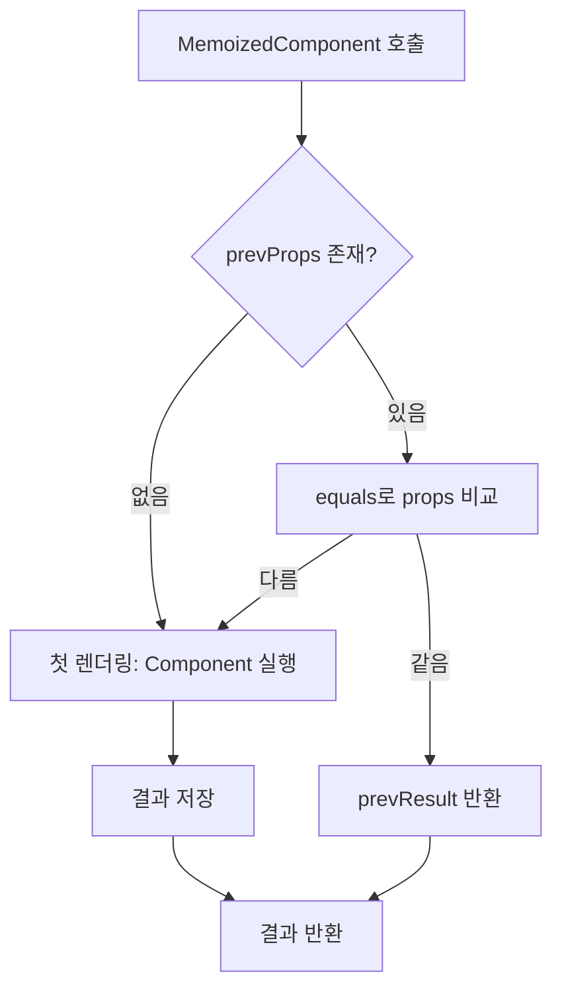
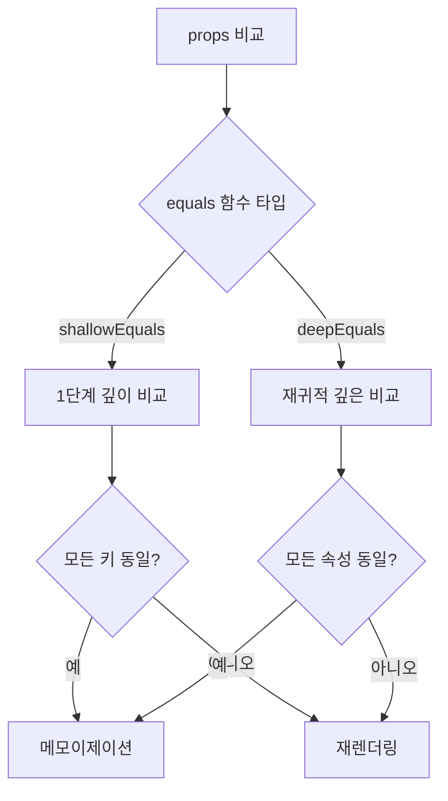

# memo HOC 구현 학습 가이드

## 📖 학습 목표

- `memo` HOC의 메모이제이션 메커니즘을 이해하고 구현할 수 있다
- props 비교를 통한 리렌더링 방지 메커니즘을 이해하고 구현할 수 있다
- `useRef`를 활용한 이전 props/결과 저장 패턴을 이해하고 구현할 수 있다
- `shallowEquals`와 `deepEquals`를 활용한 props 비교 전략을 이해하고 구현할 수 있다

## 📚 핵심 개념

### 1. memo HOC란?

`memo`는 Higher Order Component(HOC)로, 컴포넌트의 props가 변경되지 않았을 경우 마지막 렌더링 결과를 재사용하여 불필요한 리렌더링을 방지합니다.

#### 핵심 특징

- **Props 비교**: 이전 props와 현재 props를 비교
- **결과 재사용**: props가 같으면 이전 렌더링 결과 재사용
- **컴포넌트 최적화**: 불필요한 리렌더링 방지로 성능 향상

#### 사용 예시

```typescript
// 일반 컴포넌트
function Component({ value }: { value: number }) {
  console.log("렌더링");
  return <div>{value}</div>;
}

// memo로 감싼 컴포넌트
const MemoizedComponent = memo(Component);

// 사용
<MemoizedComponent value={1} />  // 첫 렌더링: "렌더링" 출력
<MemoizedComponent value={1} />  // props 같음: 렌더링 안 함
<MemoizedComponent value={2} />  // props 변경: "렌더링" 출력
```

---

### 2. memo HOC 구조

```typescript
export function memo<P extends object>(
  Component: FunctionComponent<P>,
  equals: (prev: P, next: P) => boolean = shallowEquals
): FunctionComponent<P>
```

#### 파라미터

- **Component**: 메모이제이션할 컴포넌트
- **equals**: props를 비교할 함수 (기본값: `shallowEquals`)

#### 반환값

메모이제이션이 적용된 새로운 컴포넌트

---

### 3. 메모이제이션 로직

#### 핵심 구현

```typescript
const MemoizedComponent: FunctionComponent<P> = (props) => {
  // 1. useRef로 이전 props와 렌더링 결과 저장
  const memoRef = useRef<MemoState<P>>({
    prevProps: null,
    prevResult: null,
  });

  // 2. 이전 props와 현재 props 비교
  if (
    memoRef.current.prevProps !== null &&
    equals(memoRef.current.prevProps, props)
  ) {
    // props가 같으면 이전 렌더링 결과 재사용
    return memoRef.current.prevResult;
  }

  // 3. props가 변경되었거나 첫 렌더링인 경우 컴포넌트 실행
  const result = Component(props);
  memoRef.current = {
    prevProps: props,
    prevResult: result,
  };

  return result;
};
```

#### 동작 흐름

1. **첫 렌더링**: `prevProps`가 `null`이므로 컴포넌트를 실행하고 결과를 저장
2. **두 번째 렌더링**: `equals` 함수로 이전 props와 현재 props를 비교
   - **같으면**: 이전 렌더링 결과를 반환 (컴포넌트 재실행 안 함)
   - **다르면**: 컴포넌트를 실행하고 새로운 결과를 저장

---

### 4. useRef를 사용한 이유

#### 왜 useRef인가?

- **값 보존**: 리렌더링 간에도 값을 유지
- **리렌더링 없음**: 값 변경 시 리렌더링을 트리거하지 않음
- **이전 값 저장**: 이전 props와 렌더링 결과를 저장하기에 적합

#### useState를 사용하지 않는 이유

```typescript
// ❌ useState 사용 시 문제
const [memoState, setMemoState] = useState({ prevProps: null, prevResult: null });

// 문제점:
// 1. setMemoState 호출 시 리렌더링 발생
// 2. 무한 루프 위험
// 3. 불필요한 리렌더링으로 성능 저하
```

#### useRef 사용의 장점

```typescript
// ✅ useRef 사용
const memoRef = useRef({ prevProps: null, prevResult: null });

// 장점:
// 1. 값 변경 시 리렌더링 없음
// 2. 렌더링 간 값 보존
// 3. 안전한 상태 저장
```

---

### 5. equals 함수의 역할

#### shallowEquals (기본값)

얕은 비교를 수행하여 1단계 깊이까지만 비교합니다.

```typescript
function shallowEquals(a: unknown, b: unknown): boolean {
  if (Object.is(a, b)) return true;
  if (a === null || b === null) return false;
  if (typeof a !== "object" || typeof b !== "object") return false;
  
  const keysA = Object.keys(a);
  const keysB = Object.keys(b);
  
  if (keysA.length !== keysB.length) return false;
  
  return keysA.every(key => Object.is(a[key], b[key]));
}
```

**특징**:
- 참조 동일성 우선 확인 (`Object.is`)
- 객체의 모든 키와 값을 1단계 깊이까지만 비교
- 중첩된 객체는 비교하지 않음

#### deepEquals

깊은 비교를 수행하여 모든 중첩된 속성을 재귀적으로 비교합니다.

```typescript
function deepEquals(a: unknown, b: unknown): boolean {
  if (Object.is(a, b)) return true;
  if (a === null || b === null) return false;
  if (typeof a !== typeof b) return false;
  
  if (Array.isArray(a) && Array.isArray(b)) {
    if (a.length !== b.length) return false;
    return a.every((item, index) => deepEquals(item, b[index]));
  }
  
  if (typeof a === "object" && typeof b === "object") {
    const keysA = Object.keys(a);
    const keysB = Object.keys(b);
    if (keysA.length !== keysB.length) return false;
    return keysA.every(key => deepEquals(a[key], b[key]));
  }
  
  return false;
}
```

**특징**:
- 모든 중첩된 속성을 재귀적으로 비교
- 배열과 객체 모두 깊이 비교
- 비용이 더 큼 (성능 고려 필요)

---

### 6. deepMemo 구현

`deepMemo`는 `memo`를 사용하여 `deepEquals`를 전달합니다.

```typescript
export function deepMemo<P extends object>(
  Component: FunctionComponent<P>
): FunctionComponent<P> {
  return memo(Component, deepEquals);
}
```

**사용 예시**:

```typescript
// 얕은 비교: 중첩된 객체 변경 감지 안 됨
const MemoizedComponent = memo(Component);

// 깊은 비교: 중첩된 객체 변경도 감지
const DeepMemoizedComponent = deepMemo(Component);
```

---

## 🔍 중요 포인트

### 1. props 비교 시점

props 비교는 컴포넌트 실행 **이전**에 수행됩니다.

```typescript
// ✅ 올바른 순서
if (equals(prevProps, props)) {
  return prevResult; // 컴포넌트 실행 안 함
}
const result = Component(props); // props가 다를 때만 실행

// ❌ 잘못된 순서
const result = Component(props); // 항상 실행됨
if (equals(prevProps, props)) {
  return prevResult; // 의미 없음
}
```

### 2. 첫 렌더링 처리

`prevProps`가 `null`인 경우를 반드시 처리해야 합니다.

```typescript
// ✅ 올바른 처리
if (memoRef.current.prevProps !== null && equals(prevProps, props)) {
  return prevResult;
}

// ❌ 잘못된 처리
if (equals(prevProps, props)) { // prevProps가 null이면 오류
  return prevResult;
}
```

### 3. VNode 참조 동일성

렌더링 결과(VNode)를 저장하므로 참조 동일성에 주의해야 합니다.

```typescript
// VNode는 매번 새로 생성되므로 참조가 다를 수 있음
const result = Component(props); // 새 VNode 생성
memoRef.current.prevResult = result; // 참조 저장

// 다음 렌더링에서 같은 참조를 반환
return memoRef.current.prevResult; // 같은 참조 반환
```

### 4. equals 함수의 정확성

`equals` 함수가 정확하게 동작해야 메모이제이션이 올바르게 작동합니다.

```typescript
// ✅ 올바른 equals 함수
const equals = (prev, next) => {
  return Object.is(prev.value, next.value);
};

// ❌ 잘못된 equals 함수
const equals = (prev, next) => {
  return prev === next; // 참조 비교만 수행 (객체는 항상 false)
};
```

### 5. 메모이제이션의 한계

메모이제이션은 props 비교에 의존하므로, 내부 상태 변경은 감지하지 못합니다.

```typescript
function Component({ value }: { value: number }) {
  const [count, setCount] = useState(0); // 내부 상태
  
  // value가 변경되지 않으면 리렌더링 안 됨
  // 하지만 count 변경은 여전히 리렌더링 발생
  return <div>{value} - {count}</div>;
}
```

---

## 💡 실전 예제

### 예제 1: 기본 memo 사용

```typescript
function ExpensiveComponent({ data }: { data: Data }) {
  console.log("렌더링");
  // 비용이 큰 계산
  const processed = processData(data);
  return <div>{processed}</div>;
}

const MemoizedComponent = memo(ExpensiveComponent);

function Parent() {
  const [count, setCount] = useState(0);
  const [data, setData] = useState(initialData);
  
  return (
    <div>
      <button onClick={() => setCount(c => c + 1)}>Count: {count}</button>
      {/* count가 변경되어도 MemoizedComponent는 리렌더링 안 됨 */}
      <MemoizedComponent data={data} />
    </div>
  );
}
```

### 예제 2: 커스텀 equals 함수

```typescript
function UserComponent({ user }: { user: User }) {
  return <div>{user.name}</div>;
}

// name만 비교하는 커스텀 equals
const equals = (prev: { user: User }, next: { user: User }) => {
  return prev.user.name === next.user.name;
};

const MemoizedUserComponent = memo(UserComponent, equals);

// user.name이 같으면 리렌더링 안 됨 (다른 속성 변경 무시)
```

### 예제 3: deepMemo 사용

```typescript
function ConfigComponent({ config }: { config: Config }) {
  return <div>{/* config 사용 */}</div>;
}

const DeepMemoizedComponent = deepMemo(ConfigComponent);

// config 객체의 모든 속성을 깊이 비교
// 중첩된 속성 변경도 감지
```

### 예제 4: 리스트 아이템 최적화

```typescript
const Item = memo(({ item }: { item: Item }) => {
  return <div>{item.name}</div>;
});

function List({ items }: { items: Item[] }) {
  return (
    <ul>
      {items.map(item => (
        <Item key={item.id} item={item} />
      ))}
    </ul>
  );
}

// items 배열이 변경되어도 각 Item은 props가 같으면 리렌더링 안 됨
```

---

## 🎨 시각적 자료

### memo 동작 흐름



### props 비교 전략



---

## 📌 요약

### 핵심 원칙

1. **Props 비교**: 이전 props와 현재 props를 `equals` 함수로 비교
2. **결과 재사용**: props가 같으면 이전 렌더링 결과 재사용
3. **useRef 활용**: 이전 props와 결과를 저장하기 위해 `useRef` 사용
4. **equals 함수 선택**: `shallowEquals` (기본) 또는 `deepEquals` (중첩 객체)

### 구현 포인트

- `useRef`로 이전 props와 렌더링 결과 저장
- 첫 렌더링 처리 (`prevProps === null`)
- props 비교는 컴포넌트 실행 이전에 수행
- `equals` 함수의 정확성 보장

### 학습 효과

이 학습을 마친 후, `memo` HOC를 구현하고 컴포넌트 최적화에 활용할 수 있습니다.

