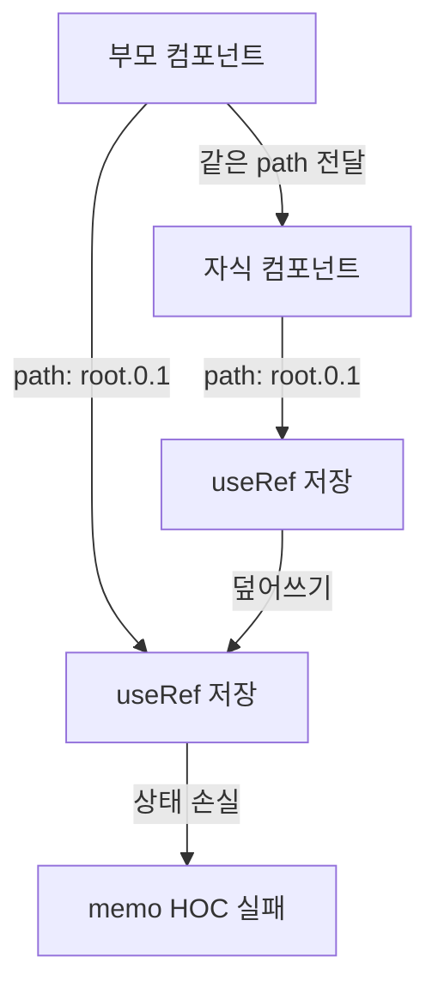
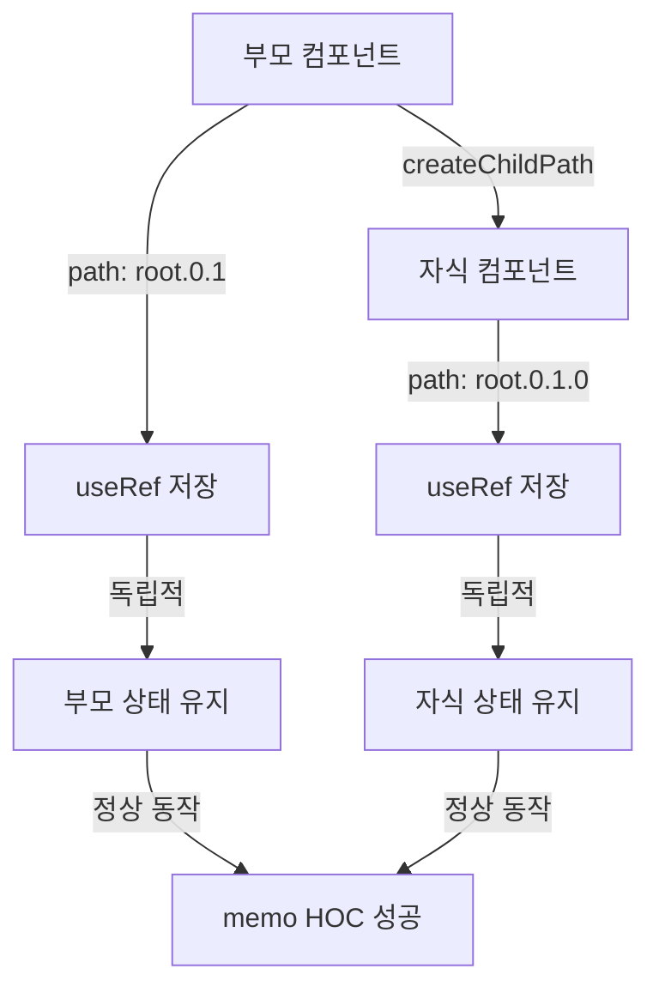
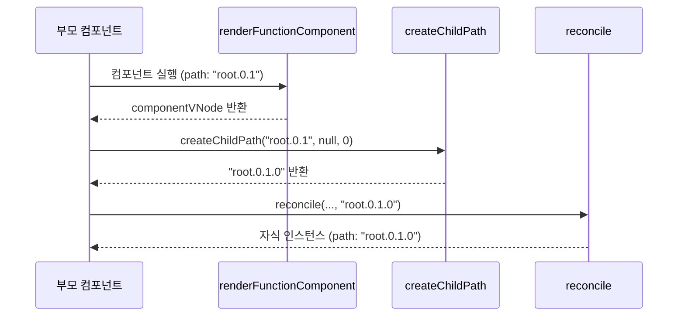

# 함수형 컴포넌트 Path 문제 해결 학습 가이드

## 📖 학습 목표

- 함수형 컴포넌트의 자식이 부모와 동일한 path를 공유하는 문제를 이해하고 해결할 수 있다
- `createChildPath`를 사용하여 자식의 고유 경로를 생성하는 메커니즘을 이해하고 구현할 수 있다
- Path 충돌로 인한 훅 상태 손실 문제를 이해하고 해결할 수 있다
- `memo` HOC가 오작동하는 근본 원인을 파악하고 해결할 수 있다

## 📚 핵심 개념

### 1. 문제 상황

`memo`로 감싼 컴포넌트에 동일한 props가 전달되어도 불필요한 리렌더링이 발생하는 문제가 있었습니다.

#### 증상

```typescript
const MemoizedComponent = memo(TestComponent);

function TestWrapper() {
  const [props, setProps] = useState({ value: 1 });
  return <MemoizedComponent {...props} />;
}

// 동일한 props { value: 1 }로 setState 호출
rerender({ value: 1 });

// 예상: TestComponent가 1번 호출됨
// 실제: TestComponent가 2번 호출됨 ❌
```

#### 원인 추적 과정

1. **1차 가설**: `useRef` 초기화 문제
   - 분석 결과: `useRef` 구현은 정상
   
2. **2차 가설**: 훅의 `cursor`가 리렌더링 시 초기화되지 않음
   - 분석 결과: `renderFunctionComponent`에서 이미 `cursor`를 0으로 리셋함
   
3. **최종 결론**: **경로(Path) 충돌**
   - 함수형 컴포넌트가 반환한 자식 VNode를 `reconcile` 할 때, 부모 컴포넌트의 경로를 그대로 전달
   - 부모와 자식이 동일한 `path`를 공유하게 되어 훅 상태가 충돌

---

### 2. Path 충돌 문제

#### 문제 발생 코드

```typescript
// 버그 발생 코드 (reconcile 함수)
const componentVNode = renderFunctionComponent(node.type, node.props, path);
// 자식(componentVNode)에게 부모의 path를 그대로 전달하고 있음
const childInstance = reconcile(parentDom, null, componentVNode, path);
```

#### 문제점

1. **부모와 자식이 같은 path 공유**
   - 부모 컴포넌트: `path = "root.0.1"`
   - 자식 컴포넌트: `path = "root.0.1"` (같음!) ❌

2. **훅 상태 충돌**
   - 부모의 `useRef`: `context.hooks.state.get("root.0.1")[0]`
   - 자식의 `useRef`: `context.hooks.state.get("root.0.1")[0]` (같은 위치!)
   - 결과: 서로 다른 컴포넌트의 훅 상태가 덮어쓰여짐

3. **memo HOC의 useRef 상태 손실**
   - `memo` HOC가 `useRef`로 이전 props를 저장
   - 자식 컴포넌트가 같은 path를 사용하면 `useRef` 상태가 덮어쓰여짐
   - 결과: 이전 props가 사라져 메모이제이션 실패

---

### 3. 해결 방법: createChildPath 사용

#### 핵심 원칙

함수형 컴포넌트의 자식은 부모와 **독립된 고유한 경로**를 가져야 합니다.

#### createChildPath 함수

```typescript
function createChildPath(
  parentPath: string,
  key: string | null,
  index: number
): string {
  const id = key ?? index.toString();
  return parentPath ? `${parentPath}.${id}` : id;
}
```

**동작 원리**:
- `parentPath`: 부모 컴포넌트의 경로
- `key`: 자식 VNode의 key (있으면 사용)
- `index`: 자식의 인덱스 (key가 없으면 사용)
- 반환값: `${parentPath}.${id}` 형태의 고유 경로

---

### 4. 수정 내용

#### 1. 컴포넌트 업데이트 로직 수정 (`reconcile` 함수)

**수정 전**:
```typescript
// 중요: 자식 인스턴스가 업데이트될 때도 같은 path를 사용해야 훅 상태가 올바르게 유지됩니다
const childInstance = reconcile(
  childParentDom,
  existingChildInstance || null,
  componentVNode,
  componentPath  // ⚠️ 부모의 path를 그대로 전달
);
```

**수정 후**:
```typescript
// 중요: 자식 인스턴스가 업데이트될 때도 같은 path를 사용해야 훅 상태가 올바르게 유지됩니다
let childInstance: Instance | null = null;
if (componentVNode) {
  // The rendered child needs its own path, derived from the component's path.
  // A function component has a single child, so its index is effectively 0.
  const childPath = createChildPath(
    componentPath,
    componentVNode.key ?? null,
    0  // 함수형 컴포넌트는 단일 자식을 가지므로 인덱스는 0
  );
  childInstance = reconcile(
    childParentDom,
    existingChildInstance || null,
    componentVNode,
    childPath  // ✅ 자식의 고유 경로 생성
  );
} else {
  // If the component returns null, unmount the existing child.
  childInstance = reconcile(
    childParentDom,
    existingChildInstance || null,
    null,
    componentPath
  );
}
```

#### 2. 컴포넌트 마운트 로직 수정 (`mountNode` 함수)

**수정 전**:
```typescript
const componentVNode = renderFunctionComponent(node.type, node.props, path);
const childInstance = reconcile(parentDom, null, componentVNode, path);
```

**수정 후**:
```typescript
const componentVNode = renderFunctionComponent(node.type, node.props, path);

let childInstance: Instance | null = null;
if (componentVNode) {
  const childPath = createChildPath(
    path,
    componentVNode.key ?? null,
    0  // 함수형 컴포넌트는 단일 자식을 가지므로 인덱스는 0
  );
  childInstance = reconcile(parentDom, null, componentVNode, childPath);
}
```

---

## 🔍 중요 포인트

### 1. 함수형 컴포넌트는 단일 자식

함수형 컴포넌트는 항상 단일 VNode를 반환하므로, 자식의 인덱스는 항상 `0`입니다.

```typescript
// 함수형 컴포넌트
function Component() {
  return <div>Hello</div>;  // 단일 자식
}

// Fragment를 반환해도 단일 Fragment VNode
function Component() {
  return (
    <>
      <div>Item 1</div>
      <div>Item 2</div>
    </>
  );  // 단일 Fragment 자식
}
```

### 2. Path 생성 규칙

자식의 경로는 부모 경로 + 자식 식별자로 구성됩니다.

```typescript
// 부모: "root.0.1"
// 자식: key가 없고 인덱스가 0
const childPath = createChildPath("root.0.1", null, 0);
// 결과: "root.0.1.0"

// 부모: "root.0.1"
// 자식: key가 "item-123"
const childPath = createChildPath("root.0.1", "item-123", 0);
// 결과: "root.0.1.item-123"
```

### 3. Path 충돌 방지

각 컴포넌트는 트리 구조에 따라 고유한 경로를 부여받습니다.

```typescript
// 수정 전 (충돌 발생)
부모: "root.0.1"
자식: "root.0.1"  // ❌ 같은 path

// 수정 후 (충돌 해결)
부모: "root.0.1"
자식: "root.0.1.0"  // ✅ 고유한 path
```

### 4. 훅 상태 격리

각 컴포넌트가 고유한 path를 가지면 훅 상태가 완전히 격리됩니다.

```typescript
// 부모 컴포넌트
path: "root.0.1"
useRef: context.hooks.state.get("root.0.1")[0]  // 부모의 useRef

// 자식 컴포넌트
path: "root.0.1.0"
useRef: context.hooks.state.get("root.0.1.0")[0]  // 자식의 useRef (독립적)
```

### 5. memo HOC 정상 동작

Path 충돌이 해결되면 `memo` HOC가 정상적으로 동작합니다.

```typescript
// memo HOC
const MemoizedComponent = memo(Component);

// 내부 동작
const memoRef = useRef({ prevProps: null, prevResult: null });
// path: "root.0.1" (부모)

// Component (자식)
function Component(props) {
  // path: "root.0.1.0" (자식, 독립적)
  // memoRef와 충돌하지 않음 ✅
}
```

---

## 💡 실전 예제

### 예제 1: Path 충돌 시나리오

```typescript
// 수정 전
function Parent() {
  // path: "root.0"
  const ref = useRef(null);  // context.hooks.state.get("root.0")[0]
  return <Child />;  // path: "root.0" (충돌!)
}

function Child() {
  // path: "root.0" (부모와 같음)
  const ref = useRef(null);  // context.hooks.state.get("root.0")[0] (덮어쓰기!)
  return <div>Child</div>;
}

// 수정 후
function Parent() {
  // path: "root.0"
  const ref = useRef(null);  // context.hooks.state.get("root.0")[0]
  return <Child />;  // path: "root.0.0" (고유)
}

function Child() {
  // path: "root.0.0" (부모와 다름)
  const ref = useRef(null);  // context.hooks.state.get("root.0.0")[0] (독립적)
  return <div>Child</div>;
}
```

### 예제 2: memo HOC와 Path 충돌

```typescript
// 수정 전 (문제 발생)
const MemoizedComponent = memo(Component);

function Wrapper() {
  // path: "root.0"
  const memoRef = useRef({ prevProps: null });  // "root.0"[0]
  return <Component />;  // path: "root.0" (충돌!)
}

function Component() {
  // path: "root.0" (Wrapper와 같음)
  const ref = useRef(null);  // "root.0"[0] (memoRef 덮어쓰기!)
  return <div>Component</div>;
}

// 수정 후 (정상 동작)
const MemoizedComponent = memo(Component);

function Wrapper() {
  // path: "root.0"
  const memoRef = useRef({ prevProps: null });  // "root.0"[0]
  return <Component />;  // path: "root.0.0" (고유)
}

function Component() {
  // path: "root.0.0" (Wrapper와 다름)
  const ref = useRef(null);  // "root.0.0"[0] (독립적)
  return <div>Component</div>;
}
```

### 예제 3: 중첩된 컴포넌트

```typescript
function App() {
  // path: "root"
  return <Parent />;  // path: "root.0"
}

function Parent() {
  // path: "root.0"
  return <Child />;  // path: "root.0.0"
}

function Child() {
  // path: "root.0.0"
  return <GrandChild />;  // path: "root.0.0.0"
}

function GrandChild() {
  // path: "root.0.0.0"
  return <div>GrandChild</div>;
}

// 각 컴포넌트가 고유한 path를 가짐 ✅
```

---

## 🎨 시각적 자료

### Path 충돌 발생 시나리오



### Path 충돌 해결 후



### Path 생성 흐름



---

## 📌 요약

### 핵심 원칙

1. **고유 경로 보장**: 각 컴포넌트는 트리 구조에 따라 고유한 경로를 가져야 함
2. **createChildPath 사용**: 자식의 경로는 `createChildPath`로 생성
3. **단일 자식 인덱스**: 함수형 컴포넌트는 단일 자식을 가지므로 인덱스는 항상 0
4. **훅 상태 격리**: 각 컴포넌트가 고유한 path를 가지면 훅 상태가 완전히 격리됨

### 구현 포인트

- `reconcile` 함수: `createChildPath`로 자식 경로 생성
- `mountNode` 함수: `createChildPath`로 자식 경로 생성
- key 처리: 자식 VNode의 key가 있으면 사용, 없으면 인덱스 사용
- null 반환 처리: 컴포넌트가 null을 반환하는 경우 처리

### 학습 효과

이 학습을 마친 후, 함수형 컴포넌트의 Path 충돌 문제를 해결하고 `memo` HOC가 정상적으로 동작하도록 구현할 수 있습니다.

