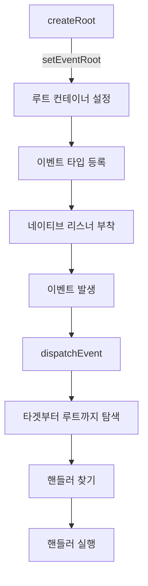
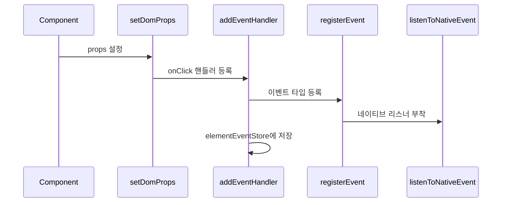

# 이벤트 시스템 구현 학습 가이드

## 📖 학습 목표

- 이벤트 위임(Event Delegation) 패턴을 이해하고 구현할 수 있다
- React DOM 스타일의 이벤트 시스템을 이해하고 구현할 수 있다
- `createRoot` 시점 이벤트 루트 설정 메커니즘을 이해하고 구현할 수 있다
- 전역 이벤트 레지스트리와 Synthetic Event를 이해하고 구현할 수 있다
- 이벤트 핸들러 등록 및 디스패치 메커니즘을 이해하고 구현할 수 있다

## 📚 핵심 개념

### 1. 이벤트 위임(Event Delegation) 패턴

이벤트 위임은 모든 이벤트 리스너를 루트 컨테이너에 한 번만 부착하고, 실제 이벤트 발생 시 타겟 요소를 찾아 핸들러를 실행하는 패턴입니다.

#### 핵심 특징

- **단일 리스너**: 각 이벤트 타입당 루트 컨테이너에 하나의 리스너만 부착
- **동적 핸들러**: DOM 요소에 직접 리스너를 부착하지 않고 메모리에 저장
- **버블링 활용**: 이벤트 버블링을 활용하여 루트에서 모든 이벤트 캡처

#### 장점

- **성능**: 리스너 수가 적어 메모리 사용량 감소
- **동적 요소**: 동적으로 추가된 요소에도 자동으로 이벤트 처리
- **일관성**: 모든 이벤트가 동일한 방식으로 처리됨

---

### 2. React DOM 스타일 이벤트 시스템

#### 핵심 원칙

1. **createRoot 시점 단일 등록**
   - `createRoot(container)` 호출 시 이벤트 루트 설정
   - 이후 `root.render`는 이벤트 루트를 다시 만지지 않음

2. **이벤트 타입 전역 레지스트리**
   - 이벤트 타입이 처음 필요할 때만 네이티브 리스너 부착
   - 이후에는 재사용

3. **Synthetic Event 디스패치 파이프라인**
   - 네이티브 이벤트 → Synthetic Event로 래핑
   - 일관된 순서로 핸들러 실행

---

### 3. 이벤트 시스템 구조

#### 전역 레지스트리

```typescript
// 등록된 이벤트 타입 추적
const registeredEvents = new Set<string>();

// 루트 컨테이너별 리스너 매핑
const rootListeners = new Map<
  HTMLElement,
  Map<string, { capture: (e: Event) => void; bubble: (e: Event) => void }>
>();

// 요소별 이벤트 핸들러 저장 (WeakMap)
const elementEventStore = new WeakMap<
  HTMLElement,
  Map<string, EventHandler[]>
>();

// 루트 컨테이너
let rootContainer: HTMLElement | null = null;
```

#### 핵심 함수

1. **`setEventRoot(container)`**: 이벤트 루트 설정
2. **`registerEvent(eventName)`**: 이벤트 타입 등록
3. **`listenToNativeEvent(eventName, container)`**: 네이티브 리스너 부착
4. **`addEventHandler(dom, eventName, handler)`**: 핸들러 등록
5. **`dispatchEvent(eventName, event)`**: 이벤트 디스패치

---

### 4. 이벤트 루트 설정

#### createRoot에서 설정

```typescript
export const createRoot = (container: HTMLElement) => {
  // 이벤트 루트 설정 (한 번만)
  setEventRoot(container);
  context.eventRoot = container;
  
  return {
    render: (node: VNode) => {
      context.root.node = node;
      render();
    },
  };
};
```

#### setEventRoot 구현

```typescript
export const setEventRoot = (container: HTMLElement): void => {
  if (rootContainer === container) return; // 이미 설정됨
  
  // 이전 루트의 리스너 제거
  if (rootContainer) {
    const listeners = rootListeners.get(rootContainer);
    if (listeners) {
      listeners.forEach(({ capture, bubble }, eventName) => {
        rootContainer!.removeEventListener(eventName, capture, true);
        rootContainer!.removeEventListener(eventName, bubble, false);
      });
    }
  }
  
  rootContainer = container;
  
  // 이미 등록된 이벤트 타입에 대해 리스너 부착
  registeredEvents.forEach(eventName => {
    listenToNativeEvent(eventName, container);
  });
};
```

---

### 5. 이벤트 타입 등록

#### registerEvent 구현

```typescript
const registerEvent = (eventName: string): void => {
  if (registeredEvents.has(eventName)) return; // 이미 등록됨
  
  registeredEvents.add(eventName);
  
  // 루트 컨테이너가 설정되어 있으면 리스너 부착
  if (rootContainer) {
    listenToNativeEvent(eventName, rootContainer);
  }
};
```

#### listenToNativeEvent 구현

```typescript
const listenToNativeEvent = (
  eventName: string,
  container: HTMLElement
): void => {
  // Capture 단계 리스너
  const captureListener = (event: Event) => {
    if (event.bubbles && event.eventPhase !== Event.CAPTURING_PHASE) {
      return; // 버블링하는 이벤트는 bubble 단계에서 처리
    }
    dispatchEvent(eventName, event);
  };
  
  // Bubble 단계 리스너
  const bubbleListener = (event: Event) => {
    if (!event.bubbles && event.eventPhase !== Event.BUBBLING_PHASE) {
      return; // 버블링하지 않는 이벤트는 capture 단계에서 처리
    }
    dispatchEvent(eventName, event);
  };
  
  // 리스너 부착
  container.addEventListener(eventName, captureListener, true);  // capture
  container.addEventListener(eventName, bubbleListener, false); // bubble
  
  // 저장 (나중에 제거하기 위해)
  if (!rootListeners.has(container)) {
    rootListeners.set(container, new Map());
  }
  rootListeners.get(container)!.set(eventName, {
    capture: captureListener,
    bubble: bubbleListener,
  });
};
```

---

### 6. 이벤트 핸들러 등록

#### addEventHandler 구현

```typescript
export const addEventHandler = (
  dom: HTMLElement,
  eventName: string,
  handler: EventHandler
): void => {
  // 이벤트 타입 등록
  registerEvent(eventName);
  
  // 요소별 핸들러 저장
  if (!elementEventStore.has(dom)) {
    elementEventStore.set(dom, new Map());
  }
  
  const handlers = elementEventStore.get(dom)!;
  if (!handlers.has(eventName)) {
    handlers.set(eventName, []);
  }
  
  handlers.get(eventName)!.push(handler);
};
```

#### setDomProps/updateDomProps에서 호출

```typescript
// setDomProps
if (key.startsWith("on") && typeof value === "function") {
  const eventName = key.slice(2).toLowerCase();
  addEventHandler(dom, eventName, value);
  return;
}

// updateDomProps
if (key.startsWith("on") && typeof nextValue === "function") {
  const eventName = key.slice(2).toLowerCase();
  
  // 이전 핸들러 제거 (참조가 다를 수 있음)
  if (typeof prevValue === "function") {
    const handlers = elementEventStore.get(dom);
    if (handlers) {
      const eventHandlers = handlers.get(eventName);
      if (eventHandlers) {
        const index = eventHandlers.indexOf(prevValue);
        if (index !== -1) {
          eventHandlers.splice(index, 1);
        }
      }
    }
  }
  
  // 새 핸들러 등록
  addEventHandler(dom, eventName, nextValue);
  return;
}
```

---

### 7. 이벤트 디스패치

#### dispatchEvent 구현

```typescript
const dispatchEvent = (eventName: string, event: Event): void => {
  let current = event.target as HTMLElement | null;
  
  // 타겟부터 루트까지 버블링하며 핸들러 찾기
  while (current && current !== rootContainer) {
    // 텍스트 노드 처리
    if (current.nodeType === Node.TEXT_NODE) {
      current = current.parentNode as HTMLElement | null;
      continue;
    }
    
    // 핸들러 찾기
    const handlers = elementEventStore.get(current);
    if (handlers) {
      const eventHandlers = handlers.get(eventName);
      if (eventHandlers && eventHandlers.length > 0) {
        // Synthetic Event 생성
        const syntheticEvent = createSyntheticEvent(event);
        
        // 핸들러 실행
        eventHandlers.forEach(handler => {
          handler(syntheticEvent);
        });
        
        // 이벤트 전파 중단 (stopPropagation)
        if (event.cancelBubble) {
          break;
        }
      }
    }
    
    current = current.parentElement;
  }
};
```

#### Synthetic Event 생성

```typescript
const createSyntheticEvent = (nativeEvent: Event): SyntheticEvent => {
  // 네이티브 이벤트를 직접 사용 (JSDOM 호환성)
  const syntheticEvent = nativeEvent as unknown as SyntheticEvent;
  
  // nativeEvent 속성 추가
  Object.defineProperty(syntheticEvent, "nativeEvent", {
    value: nativeEvent,
    writable: false,
    enumerable: true,
    configurable: false,
  });
  
  return syntheticEvent;
};
```

---

## 🔍 중요 포인트

### 1. 이벤트 루트 설정 시점

이벤트 루트는 `createRoot`에서 **한 번만** 설정되어야 합니다.

```typescript
// ✅ 올바른 방법
export const createRoot = (container: HTMLElement) => {
  setEventRoot(container);  // 한 번만
  // ...
};

// ❌ 잘못된 방법
export const render = () => {
  setEventRoot(root.container);  // 매번 호출 (비효율)
  // ...
};
```

### 2. 이벤트 타입 등록

이벤트 타입은 처음 필요할 때만 등록되고, 이후에는 재사용됩니다.

```typescript
// 첫 번째 onClick 핸들러 등록 시
addEventHandler(dom, "click", handler);
// → registerEvent("click") 호출
// → listenToNativeEvent("click", container) 호출
// → 네이티브 리스너 부착

// 두 번째 onClick 핸들러 등록 시
addEventHandler(dom2, "click", handler2);
// → registerEvent("click") 호출 (이미 등록됨, skip)
// → 핸들러만 elementEventStore에 추가
```

### 3. 이벤트 버블링 처리

이벤트 타입별로 버블링 특성이 다르므로 올바른 단계에서 처리해야 합니다.

```typescript
// 버블링하는 이벤트 (click, keydown 등)
// → bubble 단계에서 처리

// 버블링하지 않는 이벤트 (change 등)
// → capture 단계에서 처리
```

### 4. 텍스트 노드 처리

이벤트 타겟이 텍스트 노드인 경우 부모 요소로 이동해야 합니다.

```typescript
if (current.nodeType === Node.TEXT_NODE) {
  current = current.parentNode as HTMLElement | null;
  continue;
}
```

### 5. 이벤트 핸들러 재등록

`updateDomProps`에서 이벤트 핸들러는 항상 재등록되어야 합니다.

```typescript
// ✅ 올바른 방법: 이벤트 핸들러는 Object.is 체크 이전에 처리
if (key.startsWith("on") && typeof nextValue === "function") {
  // 이전 핸들러 제거 및 새 핸들러 등록
  // ...
  return; // Object.is 체크 건너뛰기
}

// 다른 props 처리
if (Object.is(prevValue, nextValue)) {
  return; // 변경 없음
}
```

---

## 💡 실전 예제

### 예제 1: 이벤트 시스템 초기화

```typescript
// 1. createRoot 호출
const root = createRoot(document.getElementById("root")!);
// → setEventRoot 호출
// → rootContainer 설정

// 2. 컴포넌트 렌더링
root.render(<App />);
// → setDomProps에서 onClick 핸들러 등록
// → addEventHandler 호출
// → registerEvent("click") 호출
// → listenToNativeEvent("click", container) 호출
// → 네이티브 리스너 부착
```

### 예제 2: 이벤트 핸들러 등록 및 실행

```typescript
function Button({ onClick }: { onClick: () => void }) {
  return <button onClick={onClick}>Click me</button>;
}

// 렌더링 시
// → setDomProps(button, { onClick: handler })
// → addEventHandler(button, "click", handler)
// → elementEventStore에 저장

// 클릭 시
// → 네이티브 click 이벤트 발생
// → bubbleListener 호출
// → dispatchEvent("click", event)
// → button 요소에서 핸들러 찾기
// → handler 실행
```

### 예제 3: 이벤트 버블링

```typescript
function Parent() {
  return (
    <div onClick={() => console.log("parent")}>
      <button onClick={() => console.log("button")}>Click</button>
    </div>
  );
}

// 클릭 시 실행 순서:
// 1. button 핸들러: "button"
// 2. parent 핸들러: "parent"
// (이벤트 버블링)
```

---

## 🎨 시각적 자료

### 이벤트 시스템 구조



### 이벤트 핸들러 등록 흐름



---

## 📌 요약

### 핵심 원칙

1. **이벤트 위임**: 루트 컨테이너에 단일 리스너 부착
2. **createRoot 시점 설정**: 이벤트 루트는 `createRoot`에서 한 번만 설정
3. **전역 레지스트리**: 이벤트 타입별로 등록 상태 추적
4. **Synthetic Event**: 네이티브 이벤트를 래핑하여 일관된 인터페이스 제공

### 구현 포인트

- `setEventRoot`: 루트 컨테이너 설정
- `registerEvent`: 이벤트 타입 등록
- `listenToNativeEvent`: 네이티브 리스너 부착
- `addEventHandler`: 핸들러 등록
- `dispatchEvent`: 이벤트 디스패치

### 학습 효과

이 학습을 마친 후, React DOM 스타일의 이벤트 시스템을 구현하고 이벤트 위임 패턴을 활용할 수 있습니다.

