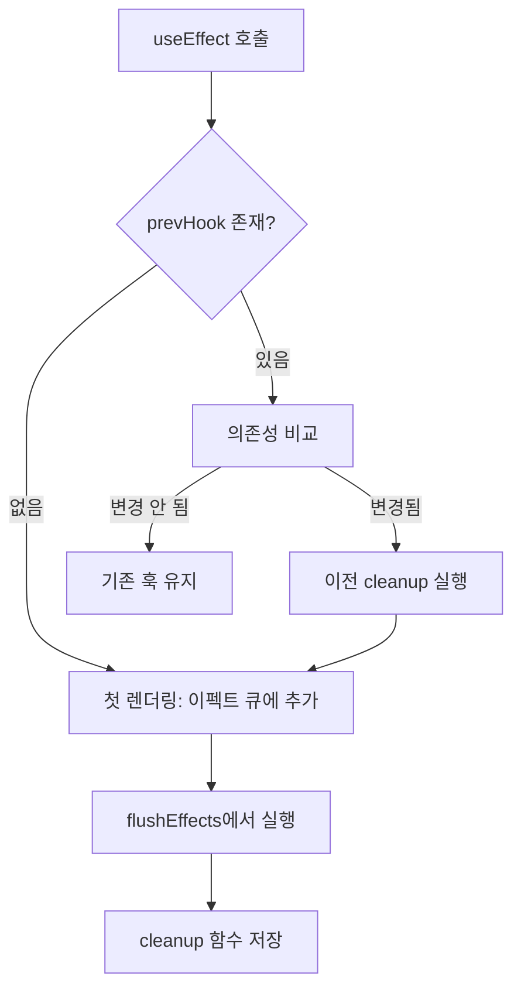
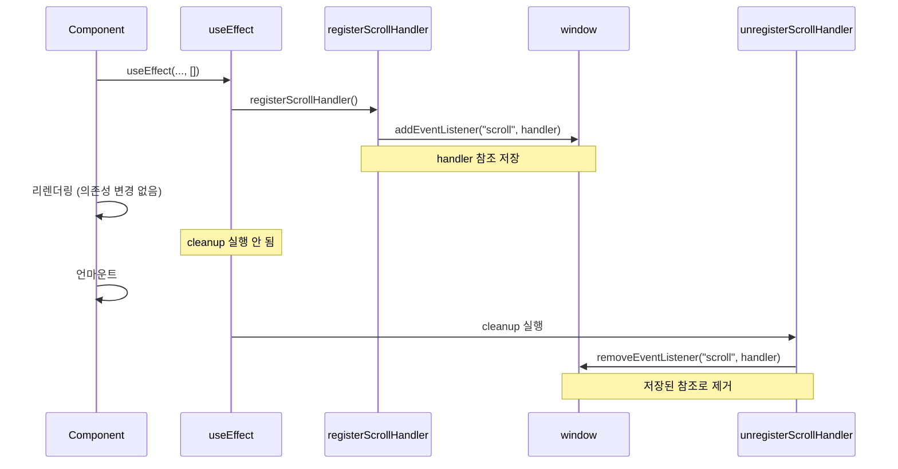

# 무한 스크롤 문제 해결 학습 가이드

## 📖 학습 목표

- `useEffect` cleanup 실행 조건을 이해하고 올바르게 구현할 수 있다
- 의존성 변경 시에만 cleanup이 실행되도록 하는 메커니즘을 이해하고 구현할 수 있다
- 스크롤 이벤트 핸들러 관리 패턴을 이해하고 구현할 수 있다
- `cleanupUnusedHooks`의 실행 타이밍과 `visited` Set 관리 메커니즘을 이해할 수 있다

## 📚 핵심 개념

### 1. 문제 상황

무한 스크롤 기능이 작동하지 않는 문제가 발생했습니다. 스크롤을 내려도 추가 상품이 로드되지 않습니다.

#### 증상

- 스크롤 이벤트 리스너가 등록되지 않음
- 스크롤 핸들러가 실행되지 않음
- `useEffect` cleanup이 예상치 못한 시점에 실행됨

---

### 2. useEffect cleanup 실행 조건

#### 문제: cleanup이 의존성 변경 없이도 실행됨

**기존 구현 (문제)**:
```typescript
export const useEffect = (effect: () => (() => void) | void, deps?: unknown[]): void => {
  const prevHook = hooksForPath[cursor] as EffectHook | undefined;
  
  // 이전 cleanup 실행 (의존성 변경 여부와 무관)
  if (prevHook && prevHook.cleanup) {
    prevHook.cleanup();  // ❌ 항상 실행됨
  }
  
  // 이펙트 큐에 추가
  // ...
};
```

**문제점**:
- 의존성이 변경되지 않았는데도 cleanup이 실행됨
- 빈 배열 `[]`을 사용하는 경우에도 cleanup이 실행될 수 있음
- 스크롤 핸들러가 등록된 직후 cleanup으로 제거됨

#### 해결: shouldRunEffect가 true일 때만 cleanup 실행

**수정된 구현**:
```typescript
export const useEffect = (effect: () => (() => void) | void, deps?: unknown[]): void => {
  const prevHook = hooksForPath[cursor] as EffectHook | undefined;
  
  // 의존성 비교
  const shouldRunEffect =
    !prevHook || // 첫 렌더링
    !shallowEquals(prevHook.deps, deps); // 의존성 변경
  
  // ✅ shouldRunEffect가 true일 때만 이전 cleanup 실행
  if (shouldRunEffect && prevHook && prevHook.cleanup) {
    prevHook.cleanup();
  }
  
  // 이펙트를 실행해야 하는 경우에만 큐에 추가
  if (shouldRunEffect) {
    const hook: EffectHook = {
      kind: HookTypes.EFFECT,
      deps: deps ?? null,
      cleanup: null,
      effect,
    };
    hooksForPath[cursor] = hook;
    context.effects.queue.push({ path, cursor });
  } else {
    // 의존성이 변경되지 않았으면 기존 훅 유지
    if (prevHook) {
      hooksForPath[cursor] = { ...prevHook, deps: deps ?? null };
    }
  }
  
  context.hooks.cursor.set(path, cursor + 1);
};
```

**핵심 변경점**:
- cleanup은 `shouldRunEffect`가 `true`일 때만 실행
- 의존성이 변경되지 않았으면 cleanup 실행 안 함
- 기존 훅은 유지하여 cleanup 함수 보존

---

### 3. 스크롤 핸들러 관리

#### 문제: 함수 참조 불일치

**기존 구현 (문제)**:
```javascript
const registerScrollHandler = () => {
  if (scrollHandlerRegistered) return;
  
  window.addEventListener("scroll", loadNextProducts);
  scrollHandlerRegistered = true;
};

const unregisterScrollHandler = () => {
  if (!scrollHandlerRegistered) return;
  window.removeEventListener("scroll", loadNextProducts);  // ❌ 다른 참조일 수 있음
  scrollHandlerRegistered = false;
};
```

**문제점**:
- `loadNextProducts`가 매번 새로 생성될 수 있음
- `removeEventListener`는 정확한 함수 참조가 필요함
- 함수 참조가 다르면 리스너가 제거되지 않음

#### 해결: 외부 변수로 핸들러 참조 저장

**수정된 구현**:
```javascript
let scrollHandlerRegistered = false;
let scrollHandler = null;  // ✅ 핸들러 참조 저장

const registerScrollHandler = () => {
  if (scrollHandlerRegistered) return;
  
  // 외부 변수에 핸들러 저장
  scrollHandler = () => {
    loadNextProducts();
  };
  
  window.addEventListener("scroll", scrollHandler);
  scrollHandlerRegistered = true;
};

const unregisterScrollHandler = () => {
  if (!scrollHandlerRegistered || !scrollHandler) return;
  
  // 저장된 참조로 제거
  window.removeEventListener("scroll", scrollHandler);
  scrollHandlerRegistered = false;
  scrollHandler = null;  // 참조 초기화
};
```

**핵심 변경점**:
- 핸들러를 외부 변수에 저장하여 참조 보존
- `removeEventListener`에서 저장된 참조 사용
- cleanup 시 정확한 참조로 제거 가능

---

### 4. cleanupUnusedHooks의 실행 타이밍

#### 실행 순서

```typescript
export const render = (): void => {
  // 1. visited Set 초기화
  context.hooks.visited.clear();
  
  // 2. reconcile 실행 (visited에 경로 추가)
  const newInstance = reconcile(root.container, root.instance, root.node, "root");
  root.instance = newInstance;
  
  // 3. 사용되지 않은 훅 정리
  cleanupUnusedHooks();  // visited에 없는 경로의 cleanup 실행
  
  // 4. 이펙트 큐 실행
  enqueue(flushEffects);
};
```

#### cleanupUnusedHooks 동작

```typescript
export const cleanupUnusedHooks = () => {
  for (const [path, hooks] of context.hooks.state.entries()) {
    if (!context.hooks.visited.has(path)) {
      // visited에 없는 경로 = 컴포넌트가 언마운트됨
      hooks.forEach((hook) => {
        if (hook.kind === HookTypes.EFFECT) {
          const effectHook = hook as EffectHook;
          if (effectHook.cleanup && typeof effectHook.cleanup === "function") {
            effectHook.cleanup();  // cleanup 실행
          }
        }
      });
      // 훅 상태 삭제
      context.hooks.state.delete(path);
      context.hooks.cursor.delete(path);
    }
  }
};
```

**동작 원리**:
1. `render` 시작 시 `visited.clear()` 실행
2. `reconcile` 과정에서 `renderFunctionComponent`가 호출될 때 `visited.add(path)` 실행
3. `cleanupUnusedHooks`에서 `visited`에 없는 경로의 cleanup 실행
4. 실제로 언마운트된 컴포넌트의 cleanup만 실행됨

---

## 🔍 중요 포인트

### 1. useEffect cleanup 실행 조건

cleanup은 **의존성이 변경되었을 때만** 실행되어야 합니다.

```typescript
// ✅ 올바른 방법
const shouldRunEffect = !prevHook || !shallowEquals(prevHook.deps, deps);
if (shouldRunEffect && prevHook && prevHook.cleanup) {
  prevHook.cleanup();  // 의존성 변경 시에만 실행
}

// ❌ 잘못된 방법
if (prevHook && prevHook.cleanup) {
  prevHook.cleanup();  // 항상 실행됨
}
```

### 2. 빈 배열 의존성 처리

빈 배열 `[]`을 사용하는 경우 의존성이 변경되지 않으므로 cleanup도 실행되지 않아야 합니다.

```typescript
useEffect(() => {
  // 등록
  registerScrollHandler();
  
  return () => {
    // cleanup: 의존성이 변경되지 않았으면 실행 안 됨
    unregisterScrollHandler();
  };
}, []);  // 빈 배열: cleanup은 언마운트 시에만 실행
```

### 3. 함수 참조 보존

`removeEventListener`는 정확한 함수 참조가 필요하므로 외부 변수에 저장해야 합니다.

```typescript
// ✅ 올바른 방법
let handler = null;
handler = () => { /* ... */ };
addEventListener("scroll", handler);
removeEventListener("scroll", handler);  // 같은 참조

// ❌ 잘못된 방법
addEventListener("scroll", () => { /* ... */ });
removeEventListener("scroll", () => { /* ... */ });  // 다른 참조 (제거 안 됨)
```

### 4. cleanupUnusedHooks와 visited Set

`cleanupUnusedHooks`는 `visited` Set을 기반으로 동작하므로, `visited` 관리가 중요합니다.

```typescript
// render 시작 시
context.hooks.visited.clear();  // 초기화

// reconcile 과정에서
context.hooks.visited.add(path);  // 방문한 경로 추가

// cleanupUnusedHooks에서
if (!context.hooks.visited.has(path)) {
  // visited에 없으면 언마운트된 것으로 간주
  cleanup();
}
```

### 5. 이펙트 실행과 cleanup의 순서

이펙트가 재실행될 때는 이전 cleanup을 먼저 실행한 후 새 이펙트를 실행합니다.

```typescript
// 의존성 변경 시
1. 이전 cleanup 실행
2. 새 이펙트 큐에 추가
3. flushEffects에서 새 이펙트 실행
```

---

## 💡 실전 예제

### 예제 1: 스크롤 핸들러 등록

```javascript
let scrollHandler = null;

const registerScrollHandler = () => {
  if (scrollHandler) return;
  
  scrollHandler = () => {
    if (isNearBottom(200)) {
      loadMoreProducts();
    }
  };
  
  window.addEventListener("scroll", scrollHandler);
};

const unregisterScrollHandler = () => {
  if (!scrollHandler) return;
  window.removeEventListener("scroll", scrollHandler);
  scrollHandler = null;
};

function HomePage() {
  useEffect(() => {
    registerScrollHandler();
    return () => unregisterScrollHandler();
  }, []);  // 빈 배열: cleanup은 언마운트 시에만 실행
  
  return <div>{/* ... */}</div>;
}
```

### 예제 2: 의존성 변경 시 cleanup

```typescript
function Component({ userId }: { userId: string }) {
  useEffect(() => {
    // 구독 설정
    const subscription = subscribe(userId);
    
    return () => {
      // cleanup: userId가 변경될 때만 실행
      subscription.unsubscribe();
    };
  }, [userId]);  // userId 변경 시 cleanup 실행 후 새 구독 설정
  
  return <div>{/* ... */}</div>;
}
```

### 예제 3: cleanup 실행 시점 비교

```typescript
// 케이스 1: 빈 배열
useEffect(() => {
  console.log("effect");
  return () => console.log("cleanup");
}, []);

// 첫 렌더링: "effect" 출력
// 리렌더링: 아무것도 출력 안 됨 (의존성 변경 없음)
// 언마운트: "cleanup" 출력

// 케이스 2: 의존성 있음
useEffect(() => {
  console.log("effect", count);
  return () => console.log("cleanup", count);
}, [count]);

// 첫 렌더링: "effect 0" 출력
// count 변경: "cleanup 0" → "effect 1" 출력
// 언마운트: "cleanup 1" 출력
```

---

## 🎨 시각적 자료

### useEffect cleanup 실행 흐름



### 스크롤 핸들러 등록/제거 흐름



---

## 📌 요약

### 핵심 원칙

1. **cleanup 실행 조건**: 의존성이 변경되었을 때만 실행
2. **함수 참조 보존**: `removeEventListener`를 위해 핸들러 참조 저장
3. **visited Set 관리**: `cleanupUnusedHooks`는 `visited`를 기반으로 동작
4. **빈 배열 처리**: 빈 배열 `[]`은 언마운트 시에만 cleanup 실행

### 구현 포인트

- `useEffect`: `shouldRunEffect`가 `true`일 때만 cleanup 실행
- 스크롤 핸들러: 외부 변수에 참조 저장
- `cleanupUnusedHooks`: `visited` Set 기반으로 언마운트된 컴포넌트만 정리

### 학습 효과

이 학습을 마친 후, `useEffect` cleanup을 올바르게 구현하고 무한 스크롤과 같은 기능을 구현할 수 있습니다.

